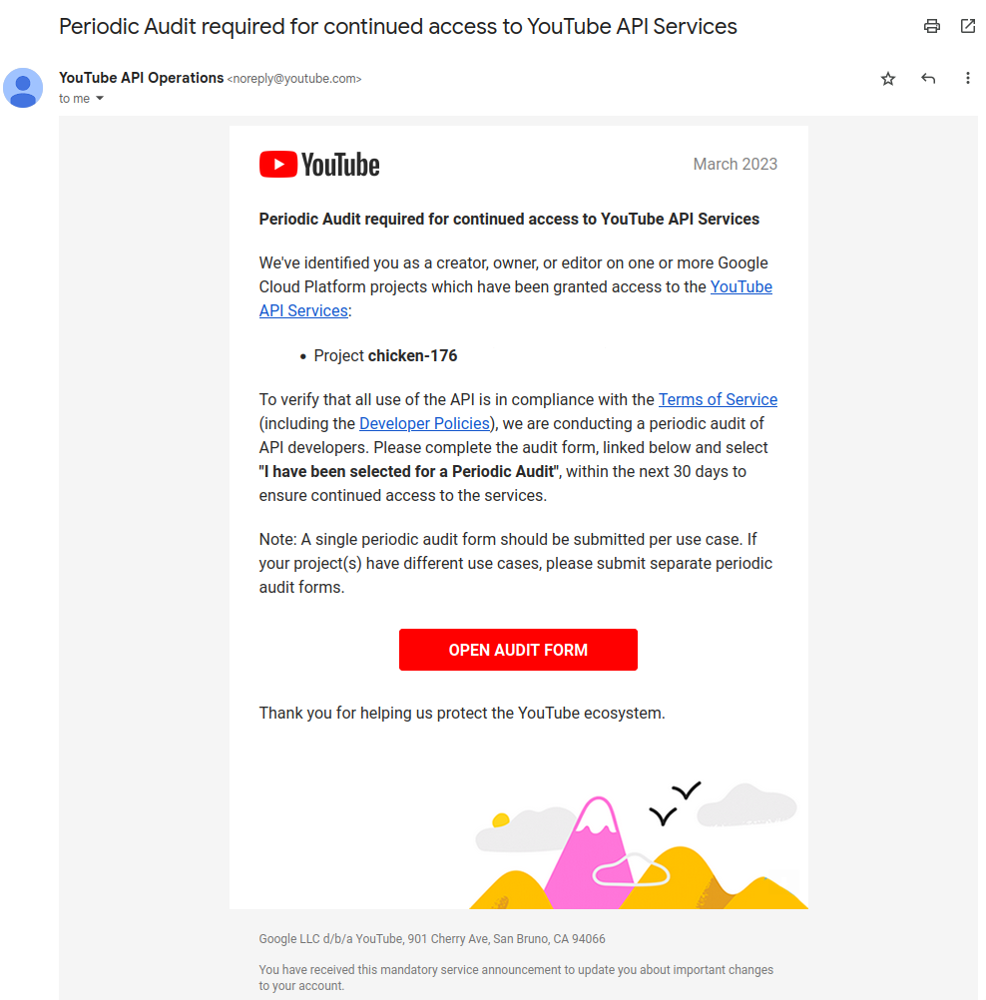
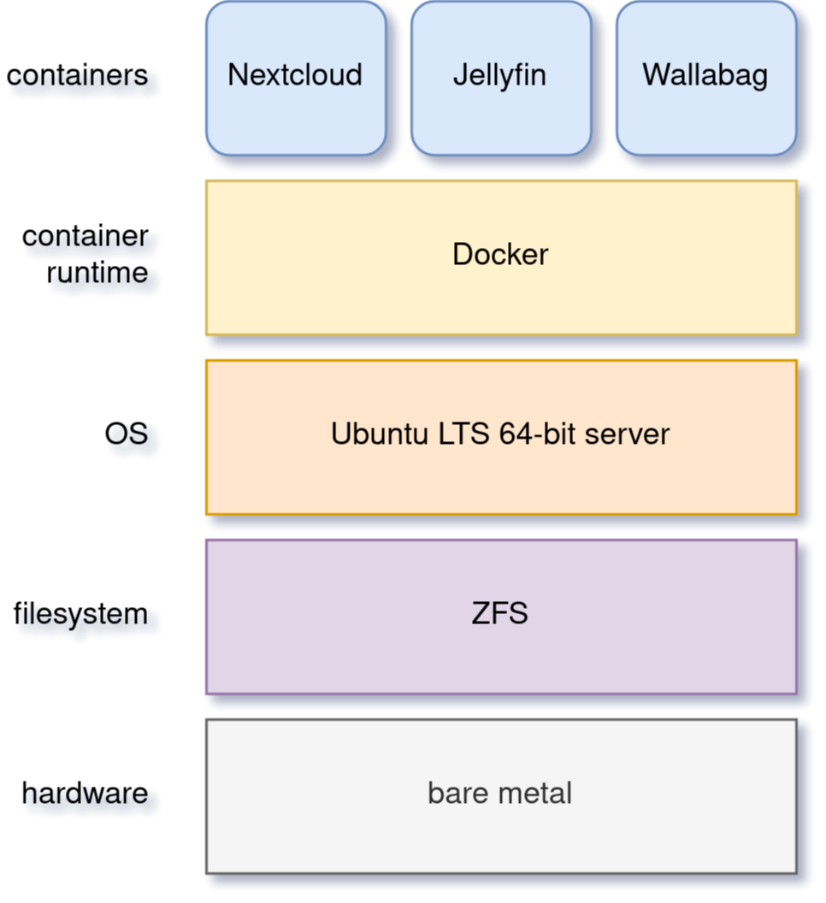
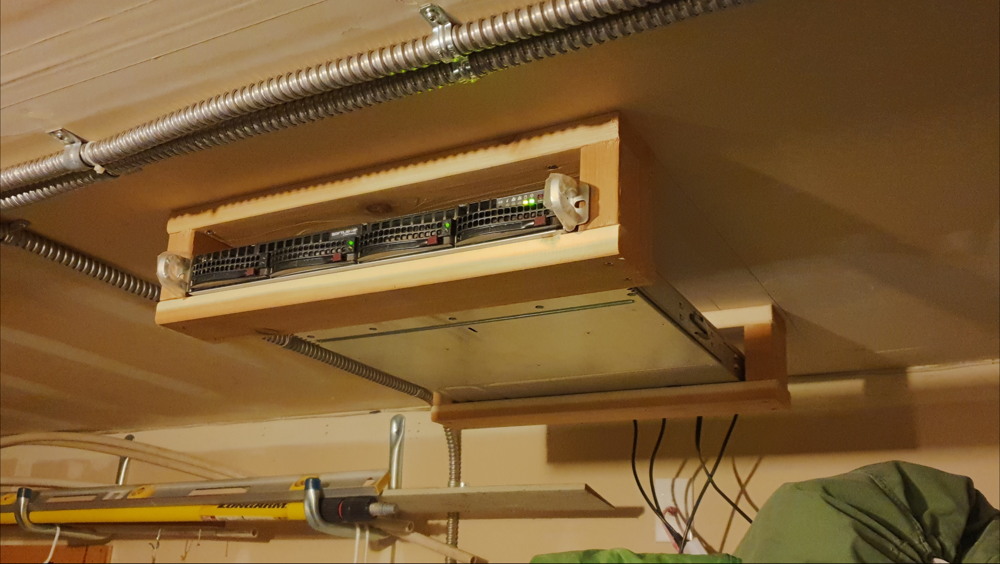
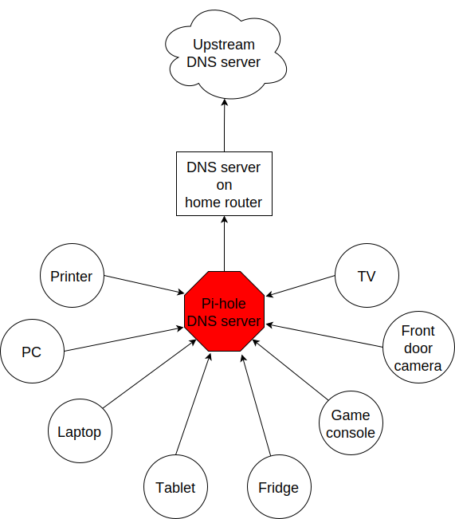

# Intro

## Thesis

This book will demonstrate data sovereignty through self-hosting.

## Welcome

The self-hosting ecosystem is crowded and confusing.

Fear not!

This book is your personal guide to joy; a battle-tested fast path to success. Together we'll quickly stand up **services** in **containers** behind a **reverse proxy**.

With these three basic components we will summon a robust data haven. We'll take some basic concepts from systems administration and devops to create love, beauty, and deep meaning.

We will:

* Not settle for cheap cloud services.
* Reduce distractions.
* Cherish our attention, time, and freedom.
* Breathe the crisp, clear air of reduced surveillance by providing our own alternative to the chilling popular default of trading privacy for convenience.
* Save money by efficiently running lots of services on our own hardware with negligible incremental cost.
* Do well by our friends, families, and social groups.
* Do things we can't do with public services because we have full access to all our own raw data.
* Adapt and grow as software evolves, taking our data and metadata along with us, sharing when it makes sense to do so and with whom we trust.

This will be liberating.

## Supporting the author

I wrote this book with my own resources after years of research with [lots of help from awesome people](#acknowledgments).

Please [buy a copy](#support-future-awesome-books) for yourself or someone else, especially if you'd like me to write more awesome books in the future.

This book is a work in progress. Please [help me improve it](#contributions).

# Version information

This book was generated

* on `%%BUILD_DATE_TIME%%`
* from git commit `%%BUILD_GIT_COMMIT%%`
* using `%%BUILD_OS_RELEASE%%`
* with language `%%BUILD_LANG%%`

# Cover art

The beautiful cover art was created by my daughter using [Krita](https://krita.org)!

# Copyright and License

_Steadfast Self-Hosting: Rapid-Rise Personal Cloud_ is copyright &copy;2023 Adam Monsen.

## Copy this book

I am humbled and grateful you are reading this.

Please make copies. I want it to be enjoyed and shared, and I chose a license that explicitly encourages sharing! Check this out:

This book is distributed under the [Creative Commons Attribution-NonCommercial-ShareAlike 4.0 International (CC BY-NC-SA 4.0)](https://creativecommons.org/licenses/by-nc-sa/4.0/) license. Contact me if you are interested in obtaining it under another license.

### You are free to

**Share** --- copy and redistribute the material in any medium or format

**Adapt** --- remix, transform, and build upon the material

*The licensor cannot revoke these freedoms as long as you follow the license terms.*

### Under the following terms

**Attribution** --- You must give appropriate credit, provide a link to the license, and indicate if changes were made. You may do so in any reasonable manner, but not in any way that suggests the licensor endorses you or your use.

**NonCommercial** --- You may not use the material for commercial purposes.

**ShareAlike** --- If you remix, transform, or build upon the material, you must distribute your contributions under the same license as the original.

**No additional restrictions** --- You may not apply legal terms or technological measures that legally restrict others from doing anything the license permits.

### Notices

You do not have to comply with the license for elements of the material in the public domain or where your use is permitted by an applicable exception or limitation.

No warranties are given. The license may not give you all of the permissions necessary for your intended use. For example, other rights such as publicity, privacy, or moral rights may limit how you use the material.

## Copy this book's code, too

I've got two things for you to fork^[copy, modify, and share].

First: the book itself, along with code to [create your own derivative works](#how-to-build-this-book). This "book source code" will assist with typesetting^[make text look nice for reading].

Second: a learning tool called _mario_. _mario_ is a small set of scripts and configuration files to help you set up and maintain your own server. It is mainly a wrapper around [Ansible](https://en.wikipedia.org/wiki/Ansible_%28software%29).

The license for all original source code related to this book is the GNU AGPL^[Affero General Public License] as published by the Free Software Foundation, either version 3 of the License, or (at your option) any later version.

A copy of the AGPL is included in `mario/COPYING`.

# Disclaimers

I offer no warranty and no guarantee.

While every precaution has been taken in the preparation of this book, I assume no responsibility for errors or omissions or for damages resulting from the use of its code or contents.

I am not professionally affiliated with the products or paid for by the companies mentioned in this book. Their copyrights, trademarks and intellectual property are their own.

My opinions are my own.

I include direct references to many products and companies and add my specific, hard-won lessons on their comparative strengths and weaknesses. My intent is to educate and inform.

I will take shortcuts! I will not seek to deeply and exhaustively explore each topic. I want you to get to the good stuff quickly, then decide if, when and where you want to dive deeper.

If you find contradictions to these disclaimers, please let me know.

I'm human and error-prone. I'll make it easy to contact me about missing or incorrect information. Please do! When you do, include references or other supporting material.

# Background

## Who am I?

I'm a dad, tech entrepreneur, and FOSS^[free and open source software] enthusiast. I love to parent, care, laugh, sing, listen, code, build, produce, debug, architect, debug, lead, manage, debug some more, lecture, and write. I'm good at administering and securing systems and processes while ensuring privacy, compliance, and reliability.

I'm most proud of my family, growing [Mifos](https://mifos.org/), founding [SeaGL](https://seagl.org), selling [C-SATS](https://csats.com), and writing this book.

I aspire to always be kind and minimize my ego.

I've been self-hosting throughout my career. I started a blog shortly after Y2K and that was enough for years. I worked with many services and servers. I avoided running my own. Once I had a family our data storage needs increased at home, and it became handy as parents to be able to provide more and safer online services for our kids. Samba and Syncthing were no longer enough; I wanted better services for managing our data.

During the pandemic our family data/service needs increased sharply, and I was wary of companies swooping in to grab mindshare. At the same time, I decided to [de-Google](https://wikipedia.org/wiki/DeGoogle). The family needs and my de-Googling coincided well. Self-hosting was a serendipitous fit. Just _trying_ to de-Google was a fascinating and fulfilling journey, punctuated with many self-hosting experiments.

## Why did I write this book?

I wrote this book to promote **data sovereignty**. I use that phrase to mean you have full control of your data. This is easier to achieve than ever before with self-hosting, and I wanted to share that out in book form. Existing books lack a good, fast, and cheap technique for self-hosting on bare metal. I figured one out and I think you'll love it! It works fine if you run your server in the cloud too, [it just costs a lot more](#server).

Also: learning is fun. I learn when I write. While learning how my phone works, it struck me how important it is to understand _how "the cloud" works_, since the modern phone experience relies on services and data in public clouds. In trying to make my phone "my own" (do what I want to help me live my best life), I was inspired to host my own data in my own cloud.

Also: everyone I know with at least a pinky toe in the tech industry self-hosts _something_. There's always another self-hosted service to try out, learn about, improve, and share.

Also: maybe I can make a buck or two doing this, or at the next thing I do. Maybe you can hire me to help you out.

Also: to write the book I wish I had when _I_ started self-hosting.

Also: there's a stark gap between useful individual computers and useful cloud services. It's easy to pay for cloud, but the true price is obscured: surveillance, lock-in, inflexibility.

Also: I can picture a future where owning a privacy-respecting home data appliance becomes as commonplace as owning a refrigerator. Creating this appliance has been attempted and it'll be attempted again. Until it succeeds and sticks: self-hosting---setting up a server and services for yourself and others---is a great way to go. And when that home data appliance _does_ land, maybe you can buy one from me!

## What's with the title?

### Steadfast Self-Hosting

I like the word _steadfast_. It reminds me of reliable things and people.

The key to reliable self-hosting is data sovereignty. Software will change, services will change, you will change and the world will change. You've got to have control of your data if you want it to reliably serve you well through all that change.

It does make a difference to [save your own copy](https://www.nytimes.com/2023/04/04/arts/dahl-christie-stine-kindle-edited.html).

Saving off data is easy. Self-hosting goes a step beyond that to give you far-reaching control of how your data are used and shared. You'll get reliability and flexibility within a reasonable budget.

Self-hosting means providing computing services by and for individuals, families, and hobbyists in so-called SOHO^[small office / home office] environments.

"Small-community-hosting" is perhaps a more accurate and appropriate term here. You're reading the right book to host services for a small community.

### Rapid-Rise Personal Cloud

_Rapid-rise_ is something you might find on a package of baker's yeast, and I love fresh-baked bread. If your server is a loaf of bread, this book is your rapid-rise yeast. 🍞

_Cloud_ implies scalable, _Personal_ scopes that to scalability to what's reasonable for a small group. Modern bare metal hardware can scale (to a degree) within its box. It can scale automatically by using more or less power according to compute demand, and manually when you upgrade hardware components (say, adding another hard drive).

I'll also admit that my inner child enjoys multiple meanings of the phrase _Personal Cloud_.

## Who is this for?

This book is for people who are kind to others, brave in trying new things, curious about the possibilities of self-hosting, and either uncertain how to do so or eager to improve their existing homelab.

This book is for people who want to know where their data live, and to be able to work all kinds of magic with it. It's a "from scratch" or "the hard way" approach, and it keeps the doors wide open to many possibilities with a principled self-hosting technique.

This book is for people curious about or already biased towards FOSS. And---as much as I'll blather on about FOSS---I'm not here to judge. I'm here to _grow_, primarily by sharing and learning.

This book is for students, especially tech-savvy or tech-adjacent students active in clubs and teams.

This book is for those trying to live more for others and less for themselves; selfishly enjoying the act of being selfless. Leaders, parents/guardians, members of a collective. People who want to self host, who _also_ love others and doing other things besides systems administration. I hope I can save you some precious time.

This book is for people supporting a small group, like a family or a handful of friends.

Similar to "small-community-hosting", _Small Group Cloud_ would be more accurate title words than _Personal Cloud_. Think of "small group" as the optimal user population size that will benefit from our services. I wouldn't bother doing all this just for yourself.

This book is for people into (or hoping to get into) self-hosting. It is geared towards useful, secure, and quick setup of a single bare metal server with many services.

This book is for people who want to *de-Google*, *de-iTunes*, *de-OneDrive*, *de-Dropbox*, *de-Whatever*.

<!-- work in or just keep in mind this phrase: _We're here to serve_ -->

## What is this book _not_?

This is not a comprehensive guide to self-hosting. I won't attempt to enumerate the endless ways to mix and match hardware, operating systems, virtual machines, and services. This book is for small scale. Look elsewhere for:

* high availability
* enterprise security
* $N + 1$ redundancy
* managing many machines
* clustering
* single sign-on
* advanced monitoring and metrics centralization
* intrusion/threat detection/prevention
* running your own container registry
* 100% offline / off-the-grid self-hosting

There are some topics like these above I'll skip or cover only briefly. Any one of these topics is an entire industry, another piece of hardware, a setting on your home router, a potential career, none or all of the above, and otherwise well worth further consideration. You can and should be aware of them. If you feel I've completely omitted proper detail about something critically relevant to my method of self-hosting, please let me know.

This book is not for the heavily-resourced already-done-thats. If you have $50k and unlimited time to spend on your concrete bunker homelab... well then, may I have a tour? I would LOVE to see that. If you are more curious than certain you may still enjoy learning from my choices and I'd appreciate your feedback.

I'm not writing for hard-line software licensing experts/extremists. These wonderful folks will spot my intentional use of the word _open_ and omission of the word _libre_. I love all these words, and I stand on the side of inclusion at the cost of idealism (while maintaining the hope these concepts are not mutually exclusive). I thank the activists for helping swing the needle towards freedom, to all our benefit.

This book is not a manifesto for always/only self-hosting. It's fine to self-host some services and pay for others. You'll come up with your own rubric on what to self-host and when. Mine focuses on providing a useful, reliable, future-proof cloud for me and my family.

This book is not the fastest path to trying out web-based services. You can usually find demo instances running for particular projects. There are cloud providers that will run a service for you and host your data.

There are one-click-install appliances with many ready-to-go apps. [FreedomBox](https://www.freedombox.org/) is one promising contender in this space.

There are shortcuts and frontends for Linux servers. For example, [openmediavault](https://www.openmediavault.org) looks like a cool way to build a DIY^[do it yourself] NAS^[network attached storage].

And there are countless more of these kinds of partial or full-service self-hosting solutions. More:

* [YunoHost](https://yunohost.org) - not considered, I prefer always using containers
* [CasaOS](https://casaos.io) - new, interesting, very little documentation
* [Runtipi](https://www.runtipi.io) - new, interesting, uses docker-compose and traefik

These look like great ideas. I evaluated them (and others) only enough to get the sense they didn't fit my wants and needs. To evaluate each in depth, one should ask:

* Will it work for years with minimal tinkering?
* Is it easily extensible?
* Does it weaken or strengthen security by changing my attack surface?
* Does it add features/value I need/want, beyond what I'm already able to do?
* Will it help my users?
* Will it help me learn what I need/want to learn, and safely take care of the rest for me without my needing to learn more?
* Will it help me figure out why I made a change to one of my services two years ago?
* Does it phone home, using telemetry or my data in a way I don't approve?
* Does it hold back "enterprise" features I need, even for my scaled-down use case? Is it annoying about this, reminding me often?
* If I want paid support, is it available?
* Is it popular? Has it been around a while, and do I expect it to endure?

After brief reviews, I find they generally:

* are new and immature
* lack proper documentation
* try to do too much without sufficient inertia/resources to maintain it all
* don't do enough: just another Linux distro with an added layer to discover and install apps
* make opinionated tech choices I don't agree with
* have a limited list of apps in their app stores and often exclude the ones I want
* have too many apps in their app store, without good ways to compare quality, privacy, features
* are GUI^[graphical user interface]-focused (e.g. beautiful, complex web interface just to install services) where I prefer working on a command line

Still, check 'em out. They might work better for you if you don't need the level of power and control provided by this book. By the time I publish, they (or some new contenders) might grow to overcome my approach. Please let me know what you discover. If I missed something, I'd love to learn about it!

Here are more related and interesting self-hosting solutions I learned about too late in the writing process to research at all:

* [Ansible NAS](https://github.com/davestephens/ansible-nas)
* [Cosmos Cloud](https://cosmos-cloud.io)
* [DockSTARTer](https://dockstarter.com)
* [HomelabOS](https://homelabos.com)
* [Start9](https://start9.com)

### Command line

The "command line" mention above is worth a beat, to understand my personal bias. It's more than a [relic from the old days, it's also a source of power and joy](https://en.wikipedia.org/wiki/In_the_Beginning..._Was_the_Command_Line). I use GUIs often, and I often *prefer* the command line and only add a GUI layer when I need one. It's often easier and faster to build and maintain a command line interface. It gives me more control and forces me to learn. It helps me understand what's happening and why. With it I'm able to quickly make changes and automate. It's also faster and more ergonomic than using a mouse.

### You'll find your path

Continuing advances in hardware and software means self-hosting today is easier and cheaper than ever before.

And in one key way, much more complex: there are an overwhelming number of choices to be made for someone starting out on this journey.

Hang in there. I'll help you narrow the choices by providing specific, focused guidance.

Don't worry too much about the specific choices you make. Your personal cloud will be malleable. Swap out bits as you like. If you choose poorly, just choose again (ideally based on metrics and user needs).

You aren't a failure if you don't get it right the first time.

It is OK to slowly migrate from whatever you currently use. No need to upset everything all at once.

It is OK to _not migrate at all_ and just follow this book to expand your own personal learning and experimentation.

It is OK if you don't adhere perfectly to your or someone else's ideals. Stick to your values while you question and develop these values. Enjoy your journey.

## Why you should self-host

Ask again---as you should---why the heck would anyone self-host software services?

So many reasons!

* Flexibility
    * run only the services you and your users want
    * use multiple services backed by the same data storage
    * automate what you want, when you want
    * unlimited sharing
    * unlimited streaming
    * unlimited choices
* Fun!
    * learn and grow (see also: suffer)
    * self-hosting is a doable challenge
    * solve right-sized puzzles as you learn and improve
    * be part of the thriving self-hosting community
* Be future-proof
    * insulate your users from the unpredictable shifting of proprietary product prices, service offerings, and UI/UX
    * share your hard-earned data to your friends and family, forever
    * migrate to something else easily if and when you need to (for example, using a newer/better photo server once one becomes available)
    * it's really the _data_ that must be safeguarded, the frontends to those data (file viewers, editors, etc) will change when _you_ choose
* Democratize computing
    * self-hosted software (especially FOSS) enables data and computational autonomy for more people
* Conserve electricity
    * backend cloud power per device drops dramatically with a few users
    * save even more power the more users you add
    * see linked articles in [Server](#server)
* Save money
    * in the long run
    * especially if/when your group's data requirements enter the terabyte range
    * save more with every service you run
    * avoid unexpected public cloud costs
        * when you want to download your data and move it somewhere else
        * when you need to do something the cloud doesn't support
    * avoid unexpected *changes in* public clouds
        * changes in license fees
        * changes in usage fees
        * changes in support costs
        * changes in service offerings
    * near-zero incremental cost of adding users and services
    * when you own your hardware outright, you have zero per-usage fees (compute, data transfer)
* Speed / Save time
    * a nearby server can have much better response times, assuming reasonable hardware and well-behaved services
    * nearby data ("data locality") means you don't need round-trips to someone else's data center to run experiments
    * shared storage allows you to front your data with multiple services, choosing read-write/read-only access sensibly
* Avoid vendor lock-in
    * You'll be able to use software features public cloud providers don't offer or don't yet exist because you fully own and control your raw data
    * When you buy something, *it's yours*. DRM should be illegal.
    * Is there an integration you count on? Sometimes a service stops working with another service. This happens less often with FOSS because anyone can simply fork a project.
* Privacy
    * avoid the chilling effect of mass surveillance
    * with a personal cloud you can safely and confidently keep GPS latitude & longitude in your photo metadata
    * once you keep your location metadata, you can do creative things with it
    * if you don't *need* to share your location and behavior with Google every second, why do you?
    * when you stream video from someone else's service, they know and analyze every time you (or your kids) (re-)watch a video you "own", every time you rewind, fast-forward, pause... but do they need to? why?
* It's not as hard as you think to self-host
    * sometimes it is harder
    * sometimes it is easier
* Unlock new possibilities
    * view travel lines with phonetrack
    * apply arbitrary workflows to uploaded files
    * deploy trustworthy, offline generative AI^[artificial intelligence] models

See [nextcloud.com/athome](https://nextcloud.com/athome/) for more self-hosting propaganda and app ideas.

### Criminal chickens

#### Peace of mind

Hosting your own data brings peace of mind.

My family has a [homemade chicken safety system](https://github.com/meonkeys/rpi-chx-code) and the videos are important to me. I used to just plop them on YouTube because hey, it's free and it "just works", right?

Except when it doesn't. YouTube sometimes felt my chickens were being spammy, deceptive, and/or scammy.

{width=80%}

For the record, our chickens are _squeaky clean_.

#### Cut the red tape

Hosting our own data brings relief from needless bureaucracy.

Yay, I don't need to complete any YouTube paperwork to be able to keep an eye on my chickens! I can safely ignore their audit and its erroneous compliance infringement warning.

{width=80%}

And hey, thanks for the reminder, YouTube! I'll remove my old YouTube API^[Application programming interface] client project, too. Turns out the Nextcloud Talk API is simpler and easier for posting my chicken coop photos & videos anyway.

No more quotas / rate limits either. Full speed ahead!

### Geo photo search

A while back I was trying to find some photos from a pile of thousands, taking up terabytes on disk. I knew _where_ the photos were taken within about 10 miles, and my photos have embedded geo metadata.

My photos are just a bunch of JPEG files. I examined them with a small program I wrote. I pulled out geo metadata and looked for anything within 10 miles of the point I knew. I used Python, and any language would work. The key was being able to access the data directly and quickly.

This is just one (likely outdated) example. By the time you read this you may be able to query your photos with a sentence like: "show me all photos taken within 10 miles of Mexico City", and it'll just work.

Then you can move on to saving the world. Just make sure you've got your data!

## Why you should not self-host

Self-hosting is more complex and time-consuming than paying for the same functionality.

If something breaks, you're fixing it. Sometimes you get a useful error, sometimes you can search the web for a quick fix. Sometimes you don't and can't.

If you don't enjoy troubleshooting and debugging, self-hosting might not be for you.

On-premise self-hosting entails additional considerations. You need to ensure sufficient power, connectivity, HVAC^[heating, ventilation, and air conditioning], and security.

## How write book?

Why are you talking like a caveman?

I wrote the book in Markdown plain text in my steadfast text editor (Vim). I applied generous amounts of Pandoc, time, and love. ❤️

In fact, here's a HUGE shout-out to [Pandoc](https://pandoc.org). That fantastic FOSS tool allowed me to use a single plain text file with fairly human-readable Markdown syntax to generate several different decent outputs.

Check out the [source code](#resources) --- you're welcome to hack away at it.

I tried to stick with off-the-shelf software as much as possible, with minimal customization. This helped me focus on the content while keeping the book simple enough to self-publish.

## When write book?

Still with the caveman. Enough already.

I wrote this in 2023.

## Where?

Seattle.

## Hey now.

Admittedly, those last few exist so I could cover all [5 Ws](https://wikipedia.org/wiki/Five_Ws).

## A note on FOSS

I prefer FOSS over non-FOSS. This can be a polarizing topic. Heck, even using the term FOSS instead of the other variants can be polarizing. These are just distractions. Today we need compromise, patience, and kindness. Curiosity over certainty.

Here's my promise to you, dear Reader:

I will try not to get too preachy.

I will prioritize *practical* solutions over *idealistic* ones. I will sometimes fail to do this when it comes to FOSS. Most notably, I will barely acknowledge the existence of non-FOSS alternatives in this book.

I'm aware of the tension between practical and idealistic solutions, and I believe this tension is a Good Thing because it reminds us to think critically about what cloud services we *should* pay for and use, not just what we *can* pay for and use. It's worth a moment's thought.

Our data matter and our personal choices matter. The impact spreads to the groups you are a part of, as does the opportunity for improvement.

I believe self-hosting FOSS is doable and affords many practical benefits over non-FOSS.

Hang in there and give me some feedback. You'll strike your own balance between idealism and practicality and I'm interested to know where you land.

Continued ad nauseam in [More about FOSS](#more-about-foss) near the end of this book.

## Surprises

Should you choose to proceed: godspeed, traveler! This is seriously fun stuff.

You may be surprised by how fast & easy some things are with self-hosting. I'd love to know how this goes for you.

You may also be surprised by how time-consuming and difficult some things are. Maybe you'll get held up with hardware (and its power, wires, cooling, failures). Maybe networking. Maybe "change management" (trying to convince your users to use Nextcloud instead of Dropbox).

Here are some things that surprised me, both positively and negatively.

### Good surprises

#### Hardware

With help from a friend (thanks Rob!), I bought a reliable and cheap server. I could've saved a few bucks by buying parts, but I wanted something ready to power on. Still, I thought I'd be tinkering with wires, cards, and CMOS batteries. Not so! I only opened the chassis to see the guts. It looked like normal server guts in there. Took me longer to build a rack for my server than it took me to power it on.

#### Containers

I was pleasantly surprised by containers since most of my earlier experience was with VMs^[virtual machines]. Containers are excellent for a consistent and resilient personal cloud. They are fast and small compared with VMs, allowing higher non-conflicting service density. That is, you can stand up more services per server and they don't interfere with one another (e.g. by requiring different versions of PHP^[PHP: Hypertext Processor]).

Isolation of containers is limited compared to VMs. The kernel is shared, for example. Limited isolation keeps the resource and maintenance costs of container-based isolation low compared with VMs.

Containers are easy to declare (in code), build, deploy, test, and repeat.

I chose Docker to manage containers because it is popular and I have experience with it. Your server is also considered a _host_ since it it is a _host_ to Docker containers.

One downside of Docker is how often root access is assumed in example code and popular publicly images. Running as root makes containers simpler and less secure.

#### OCR

Another smile-worthy advancement is free OCR^[optical character recognition]. I keep trying to "go paperless" by scanning in all my paper files. After scanning I was shouldered with, unsurprisingly, a bunch of PDFs of images. These can be easily processed and searched with tools like [Nextcloud Full text search](https://apps.nextcloud.com/apps/fulltextsearch).

#### Jellyfin

I was stoked to see how Jellyfin showed up as an excellent and complete FOSS alternative to Plex.

### Bad surprises

#### Traefik

Traefik was surprisingly challenging to set up because my networking fundamentals were rusty. I've got it working reliably and I still need to keep improving my fundamental knowledge in networking.

#### Nextcloud

I was frustrated with some bugs in Nextcloud. These felt like the most urgent since I rely heavily on it.

Community support is hit or miss. Nextcloud seems more popular outside the USA.

[Not all Nextcloud apps are ready for prime time](#customization).

#### Jitsi

I gave up trying to get Jitsi running in Docker. I recall lots of open ports or port ranges being a problem. This one might be easier in a virtual machine.

I will eventually give it another shot because [logging in is now required](https://jitsi.org/blog/authentication-on-meet-jit-si/) when using the free 8x8-hosted Jitsi service.

### Absorb them all

When it comes to surprises, try to absorb the bad ones when they affect your users. Ideally _before_ they affect your users, via research, planning, and testing you're likely already doing.

Dogfood what you self-host. Try your best to ensure everything is attractive and useful, then wait. Be patient. Never try to force people to use whatever you self-host.

I hope this book inspires you with many positive surprises and helps you and your users avoid many negative ones. It's dangerous to go alone! Take this book. 📖

{width=80%}

# Prerequisites

## Skills

This book assumes some prerequisite skills. You must be able to:

* configure your router and LAN^[local area network]
* install Linux on a computer (hereafter referred to as your _server_)
* execute programs using a terminal / command line
* connect to your server with SSH
* edit text files and run commands on your server
* transfer files to and from your server

Optional, and helpful:

* familiarity with [git](https://git-scm.com) and [Bash](https://www.gnu.org/software/bash/)
* forgive my mistakes and inaccuracies and help me improve

## Experience level

New self-hosters can use this book to get started.

Experienced self-hosters can compare my choices to theirs.

## Mindset

* be kind
* minimize your ego
* ask for help
* ask for feedback
* listen to users, gather data, adapt accordingly

## Discipline

* document everything you do
    * if only for your future self!
* train help in case you get hit by a bus
    * made much easier since you've documented everything
* focus, take breaks, be patient
* sleep, exercise, eat healthy

# System design

A _mario_-built system presents nicely as a simplified stack of colored boxes. These are conceptual, based on where and how frequently I act and investigate when supporting or troubleshooting.

{width=80%}

I am most often working around the top layers e.g. adding or updating a container.

Less often I am updating OS^[operating system] packages.

Less often still I might examine versions of a configuration file stored on disk from its ZFS automatic snapshots.

Finally, when my server dies, I'll be on that bottom layer fixing or replacing hardware.

## Filesystem

ZFS is our one-stop shop for efficiently and safely making hard drives available for our OS and data. Encryption, automatic lightweight snapshots and RAID^[redundant array of inexpensive disks] are all included and used by _mario_.

The root partition is ext4 (not ZFS) for a few reasons:

* stick as closely as possible to the default Ubuntu install
* sidestep a Docker annoyance
    * when `/var/lib/docker` is on ZFS, many snapshots are created, perhaps one per container
* we have less of a need for backups of the OS
    * it doesn't/shouldn't change, or at least its changes will be managed upstream (e.g. OS package updates)

Docker volumes will be on ZFS. The container's filesystem---everything besides mounted volumes with persistent data---is ephemeral and stored on ext4 in `/var/lib/docker`.

### ZFS trim

Note that if you use SSDs, you may notice your system unexpectedly grinding to a halt once a month as it performs a "trim". This is not an issue with HDDs.

On my desktop (not my server---I use HDDs in that) I see the trim cron job is scheduled for the first Sunday of every month, in `/etc/cron.d/zfsutils-linux`.

I saw this happen once on my desktop. The trim job caused high values in `/proc/pressure/io` and I saw `z_trim_*` kernel threads doing heavy I/O in the process table (hint: use `top` or `htop` to view the process table).

If you run into this issue, give ZFS a couple hours to finish trimming or run `zpool trim --cancel <pool>`, replacing `<pool>` with the name of the pool being trimmed. You can get the name of the pool and monitor trim progress with `zpool status -t`.

Shout out to [askubuntu: Should I turn on zfs-trim on my pools or should I trim on a schedule using systemd timers or cron?](https://askubuntu.com/questions/1200172/should-i-turn-on-zfs-trim-on-my-pools-or-should-i-trim-on-a-schedule-using-syste), too.

## Operating system

_mario_ requires a 64-bit Ubuntu server. Other Debian Linux flavors may work as well.

Ubuntu LTS^[long-term support] releases are the most stable so we'll stick with that.

I sought to minimize customizations to the operating system from a default install to ease its eventual re-creation. I tried to capture any and all necessary customizations in _mario_, or at least to document them.

Not mucking about on the server takes discipline, especially for old-school hands-on sysadmins like me. It is much easier to SSH into the server and run a one-off command rather than change config files and re-run _mario_. The real payoff from using _mario_ instead of hand-editing comes when you collaborate with others or try to remember what you did a year ago and why.

You can and should still SSH into the server manually. When you do, you should exclusively perform read-only or exceptional read-write operations. I often do something manually, undo it, then do the same thing with _mario_ to confirm results are as expected.

Example read-only server-side operations:

* show per-container resource usage: `sudo docker stats`
* follow container log messages: `sudo docker-compose logs -f` (run this in a folder containing a `docker-compose.yml` file)
* check server health: `date; tail /proc/pressure/*`

Read-write operations:

* upgrade OS packages: `apt full-upgrade`
* upgrade services: `docker-compose pull && docker-compose up -d` (at least for those not auto-upgraded by [watchtower](#watchtower))

Start a "monthly maintenance" list and include these read-write operations. Always use `sudo` instead of logging in as the `root` user. This ensures every command is captured in `/var/log/auth.log` along with when it was executed, and by whom.

Upgrades may be automated. This is appropriate once you have sufficient scale (along with trust/control of the source of the upgrades). I choose to do some OS upgrades manually because:

* I manage few systems so the burden is minimal and infrequent
* Upgrading a package may require testing or manual intervention (e.g. rebooting)

These reasons are similar to the reasons I install the OS itself by hand.

My OS is more a pet than cattle (see "cattle vs. pets" in the [glossary](#glossary)), although it is relatively easy to rebuild since I've limited and documented my customizations.

## Container runtime

We'll use Docker.

Not VMs^[If you intend to self-host Jitsi, you might want to do that in a VM. I had some issues trying to get Docker to handle the ranges of open ports Jitsi requires.].

Not Kubernetes. Too much extra stuff to learn. We don't need it.

Docker (via `docker-compose`) balances features and usability well, making it easy to run groups of processes necessary to support a whole service (e.g. a web server and its database). Kubernetes has this, along with everything you _don't_ need to learn unless you are building out an entire virtual data center. Docker compose is a good fit for our single-server setup.

We'll also not use one or more LAMP^[Linux, Apache, MySQL, PHP] stacks alongside everything else on our server's primary storage. Having everything on one filesystem is easy at first, for one service. [It gets more complicated the more services you add](https://en.wikipedia.org/wiki/Dependency_hell). Many of the desperate support requests I see in FOSS communities are about incompatibilities between this or that version of PHP or relational database between two different services. Docker mitigates this by bundling dependencies. Each Docker image is basically a complete filesystem (sans kernel) including, for example, the best fit PHP interpreter and database.

It's worth lingering on bundled dependencies for a minute. If dependencies are clothes, a Docker image is a suitcase with all the clothes you need for a week's travel. You check your suitcase and board the train, then rest easy knowing your suitcase is tucked neatly next to all the others. Docker containers are suitcases while the old way is a giant shared pile of personal effects for every passenger.

An image is the blueprint to magic a fresh new suitcase (container) into existence, all packed and ready with the right clothes for your trip. An image can be built once and shared by many, creating countless containers. Each image has its own unique and consistent identifier. Images are defined by a config file named `Dockerfile`. The `Dockerfile` should be tracked in source control. Since we'll use Docker Compose, another important config file is `docker-config.yml`. Each service will have its own `docker-config.yml` file. These should be kept in source control too. For sysadmins these conventions provide reproducible images and containers. For users: predictable, reliable services.

Containers work best as temporary things. You'll gain confidence in your system by creating and destroying them frequently, and you'll enjoy the speed and ease of doing so.

Think:

* ephemeral
    * containers are temporary
    * temporary containers provide robust, reproducible services
* treat containers like cattle, not pets
    * hand-managed VMs are burdensome pets
    * apologies to the cattle---in this analogy they are expendable
* stateless
    * persistent data can and must be defined explicitly
* [phoenix server](https://martinfowler.com/bliki/PhoenixServer.html)
    * a term by Martin Fowler describing the benefits of short-lived servers that can be easily re-created

## Reverse Proxy

We'll use Traefik. I'm told Caddy is also nice, and there are many other options as well.

A reverse proxy sits in front of containers and directs traffic to the right service based on arbitrary rules. We'll direct our traffic using host names.

Traefik provides other handy features too, such as automatic HTTP encryption certificate handling with [Let's Encrypt](https://letsencrypt.org/).

## Identity management

I wanted to include FOSS central identity management in _mario_ but I haven't figured it out yet. That is, some way to log in once and get to all the different services you have access to in your cloud. Authentication and authorization and all that good stuff.

I'm interested in [Authentik](https://goauthentik.io/) because it appears to have all the features I want (single sign-on, backend user database, integrates with everything I self-host). I want to see it running well for a good while before adding it to _mario_.

Some of the other self-hosting solutions mentioned above in [What is this book _not_?](#what-is-this-book-not) do include FOSS central identity management.

# Implementation

## Plan

Consider the time and cost of self-hosting. To yourself *and your users*.

I love this part! I get excited about what's to come, and I know a solid plan makes a vision real. I start by capturing my plans in a [Markdeep](https://casual-effects.com/markdeep/) file, including a calendar, budget, network diagram, to-do list and notes.

Make _your_ plan. Maintain and improve your plan along with your server. Share the plan with other admins.

Yep: other admins. You need someone to cover for you when you are not available, or a crystal clear expectation that when you die, the server dies too.

### Budget

How much do you have/want to spend? Write down a number and stick to it.

### Resources

Sketch out your thoughts on resources you'll need. Some ideas:

* Data storage. There's a significant jump in complexity and cost with each jump in unit (for example, GB^[gigabyte] to TB^[terabyte]). This book is appropriate for data storage up to about 10 TB.
* Electricity. Check your home power bill for the cost per kWh and run some estimates.
* Support. Who will help you when you get stuck?
* Physical location. Where will the server live? Will you have to install new wiring for power or network?

### Schedule

Rough out key dates so you and your users can plan ahead. For example:

* Apr 28: Brainstorm, plan.
* Apr 30: Order hardware.
* May 3: Pull ethernet from router into garage.
* May 5: Set up server.
    * Install hard drives.
    * Power on!
    * Install operating system.
    * Start services.
* Jun 9: Review result against original goals.

Invite others to participate, starting at the "brainstorm" step. This is a great time to include other people who may help care for the server.

### Choose services

A service is something useful you'll self-host. These are typically one or more containers. Services may be accessed from a web browser or mobile device, or they may simply run in the background on a schedule.

#### Good for self-hosting

You'll find some services are better choices to self-host than others. They will likely share at least some of these attributes:

* Self-hosting instructions included in the service's documentation.
* Popular, well-maintained image exists on [Docker Hub](https://hub.docker.com).
    * Especially a [Docker Official Image](https://docs.docker.com/docker-hub/official_images/).
* Healthy community: chat, forum.
* Recent source code activity: releases, contributions, news.
* Uses a FOSS software license such as the AGPL.
* Transparent about owners and sponsors.
* Public roadmap, issue tracking, continuous integration, working demo, build scripts, bug/security bounties.
* Well-organized, elegant code.
* Refers to other similar projects.

[Nextcloud](https://nextcloud.com) has many of these, with some exceptions. One exception is [their secret build script](https://help.nextcloud.com/t/build-bzip-and-package-from-git/58341). This is convenient for them to maintain control of a complex system, but worse for eventual succession. Nextcloud is a fork of ownCloud, after all. We should expect another fork and be prepared for it.

The sprawling complexity is also risky. "Nextcloud" is not one thing, it is a collection of _many_ software projects and services under various degrees of control by a single company. Forking would be costly and time-consuming. Even switching forks may be difficult for a sysadmin. This is a form of vendor lock-in.

#### Bad for self-hosting

* Your users don't want it or won't use it.
* Unpopular, inactive, or poorly maintained.
    * Few maintainers / contributors.
    * Maintainers are inattentive to contributors.
* Includes telemetry ("phones home"), especially without your consent.
* Confusing or opaque governance, roadmap, licensing, source control, contribution intake, issue tracking.
* Sprawling complexity.
* Difficult to fork.
* Only geared towards enterprise, complex or absent self-hosting instructions.
* Constant annoying upsells/nags.
* [Open core](https://en.wikipedia.org/wiki/Open-core_model).

[Habitica](https://habitica.com) demonstrates several of these.

### Map services to resources

Here's an early, rough resource planning table I used:

<center>
| service      | isolation | cores | RAM (GB) |
|--------------|-----------|-------|----------|
| plex         | Docker    | 2     | 2        |
| kahoot-clone | Docker    | 0     | 0        |
| poller       | Docker    | 0     | 0        |
| backuppc     | none      | 0     | 0        |
| taskd        | Docker    | 0     | 0        |
| sftp         | none      | 0     | 0        |
| syncthing    | none      | 1     | 1        |
| peercoind    | none      | 0     | 0        |
| nextcloud    | Docker    | 2     | 2        |
| minecraft    | Docker    | 4     | 8        |
| irssi        | none      | 0     | 0        |
| jitsi        | Docker    | 2     | 2        |
| wallabag     | Docker    | 1     | 1        |
</center>

This chart (and [more learnings, below](#server)) told me I'd need something more powerful than the latest available Raspberry Pi.

## Prepare hardware

It's called _hard_ ware because these problems are _hard_.

That's fun to say and, in my experience, false.

It's true there is a learning curve for understanding basic computer hardware components, but it is also tangible and behaves consistently, more or less.

Software problems easily and often outpace hardware problems.

### Server

You'll need a server.

You could use a VM in someone else's cloud, but it'll end up costing more. For that and other various reasons I'll focus on bare metal.

You can start with pretty much any old desktop or laptop. Use something more powerful and expandable than a Raspberry Pi, though. What if your users love it? What about bursty workloads? Adding storage later? If you start with something too small you won't have enough speed nor expandability.

I've worked with quite a few different servers and I did my homework for this self-hosting adventure, so I had a decent idea of what I wanted.

I chose something powerful, cheap, and fast with plenty of storage and room to grow. I sought professional commodity hardware for its replace-ability. It can handle a reasonable amount of bursty compute needs, including building Docker images, flurries of user activity, and some generative AI (even without a GPU).

I found a used refurbished 1U rackmount server on eBay for about $1,000. Two 24-core CPUs and 128 GB RAM. Tech companies dump these by the truckload so you can usually find a good deal.

{width=80%}

The fans are **way** louder than a desktop, especially when it is under load. It needs decent ventilation, temperature and humidity regulation. It has several enterprise features to ease maintenance such as redundant power supplies, hot-swap drive bays, lots of sensors, and a remote console.

Power consumption averages 130W, or about 1,140kWh per year; roughly $138.15 in Seattle. That's about as much as a bright incandescent light bulb, and it's a bit wasteful for one user. Five users though? ~228kWh/year each. That's less than the cloud server hardware required for a mobile device making use of Google's or Apple's clouds. Further reading on this topic:

* [Time article on cloud power usage](https://science.time.com/2013/08/14/power-drain-the-digital-cloud-is-using-more-energy-than-you-think/)
* [Guardian article on what your phone needs in the cloud](https://www.theguardian.com/sustainable-business/2014/sep/10/energy-consumption-behind-smart-phone)
* [Increment article on phone energy impact](https://increment.com/energy-environment/the-secret-energy-impact-of-your-phone/)

A rackmount server like mine can handle far more than 5 users, assuming they aren't all trying to transcode video.

### Admin computer

It's helpful to have a separate computer from your server to make changes. I usually run _mario_ on a laptop. This connects to and "provisions" my remote server, making changes as necessary to align it with the Ansible configuration files.

### Test devices

Your users will have their own computers and mobile devices (their _clients_). You should have a couple different clients of your own, so you have comparable environments to better help your users.

You should also be a user of the stuff you self-host. This is _dogfooding_. Dogfooding keeps you honest and helps you empathize with others.

### Hard drives

I use HDDs^[hard disk drives] for data storage, mainly as a cost-saving measure. The cost of public cloud block storage far exceeds the gigabyte-hour cost of my HDDs. I priced out one month of 5TB HDD block storage on AWS at $228.10. With ZFS I'm also taking a snapshot (bascially a full local backup) _every 15 minutes_. One month's worth of hourly snapshots (the closest comparable I could find) is another $310.68. That's $535.67 total, which is about what I spent on my drives. So I broke even in a month and the drives should last _years_.

For redundancy I recommend purchasing two of the same drive. We'll configure them mirrored (RAID 1). This increases redundancy and read performance (for most reads) and halves usable storage space.

HDDs are plenty fast when measured from the standpoint of self-hosted service response time. The OS^[operating system] and services do well at caching data served, assuming the server has sufficient RAM. Remote backups can take a while, and that's fine.

I use one SSD^[solid-state drive] for the OS and everything besides my photos/documents/etc, since start-up time for the OS is important and realizes far less benefit from the OS filesystem cache (especially at boot time).

Read more about SSDs and TRIM in [Filesystem](#filesystem).

### Networking

If you are hosting at home, you need a reliable WAN^[wide-area network] connection if you want to be able to connect from other places besides your LAN.

Use wired ethernet cables to your server, not Wi-Fi.

#### Minimum specs

Here are some typical minimum specs for a home:

* 750mbps up / 750mbps down ISP connection
* Cat 5 ethernet cable
* 802.11ac Wi-Fi (for clients)

I just made these up based on what I estimated I'd need, then doubled that to allow some room to grow.

#### Home router configuration

Learn how to configure your router. Keep it up to date and maintain a strict firewall with only the necessary ports open / forwarded.

⚠️ Warning: port-forwarding allows inbound connections through your WAN boundary to your server. Read more about [digital security](#digital-security) before forwarding any ports.

Here's a simple diagram I created (in [ASCIIflow](https://asciiflow.com)) to visualize my server's location and network connection, a "WAN into LAN traffic flow diagram". The router provides electricity to the mini switch using PoE^[power over ethernet]. There server has two NICs^[network interface cards]: one is for the OS and everything within (including all services), the other provides a network connection to the embedded OOB^[out-of-band] computer with IPMI^[Intelligent Platform Management Interface]. All arrows are ethernet cable.

{width=80%}

### Electricity

Use a surge protector.

Also consider a UPS^[uninterruptible power supply] if your power at home is unreliable.

### Physical security

Keep your server safe similar to other valuables in your home.

At the very least, restrict physical access.

## Deploy

Here's an abbreviated server setup guide. Take notes and visualize yourself repeating the process.

1. Install Ubuntu Server. Debian might also work; I haven't tested it.
    1. Use the latest LTS release. I used a "64-bit Ubuntu 22.04 LTS server" image.
    1. [Follow a tutorial](https://ubuntu.com/tutorials/install-ubuntu-server) if you prefer.
    1. At each prompt, use defaults or write down exceptions you make to defaults. Anticipate repeating this install process precisely.
    1. Optional: use full-disk encryption. See below.
    1. Install OpenSSH server.
    1. Do not install `nextcloud` or `Docker`. Let _mario_ install these later.
1. Set up _mario_ on your admin computer (a separate computer from your server).
1. Optional: add two HDDs and format them with ZFS. See below.
1. Run _mario_ on your admin computer to provision your server.

The following sections expand on the details of this process.

After reading about full-disk encryption and ZFS, [pick services](#services) and [stand them up with _mario_](#mario).

### Full-disk encryption

Encrypting prevents data recovery by an attacker. You'll have to enter a password on boot, though. This is inconvenient if you have intermittent power and/or no remote console.

If you decide you want full-disk encryption, choose it during the OS install. The section on [digital security](#digital-security) is helpful for deciding whether or not to encrypt.

### ZFS

The OS takes care of itself pretty well. For data storage, let's add a couple of HDDs and manage them with ZFS.

ZFS adds many features and some complexity. The learning curve is worth it. We'll start with a simple mirrored 2-drive pool.

On the server, run these commands as root, adjusting as necessary. For example, these assume you've added two drives and they were assigned device names `/dev/sda` and `/dev/sdb`. Use `lsblk` to figure out your device names.

```bash
# Create partition tables.
parted /dev/sdb print
parted /dev/sdb mklabel gpt
parted /dev/sdc print
parted /dev/sdc mklabel gpt

# Create ZFS main mirrored pool and set attributes (for all future datasets in this pool).
zpool create -o ashift=12 -O mountpoint=none main mirror /dev/sdb /dev/sdc
# For performance.
zfs set atime=off main
# To save space.
zfs set compression=on main
# For security.
zfs set exec=off main
zfs set setuid=off main
zfs set canmount=off main

# Create encrypted dataset in "main" pool.
# This is our "parent" dataset, we can easily add more later and they'll all be encrypted.
openssl rand -base64 32 > /root/secure-dataset-key
zfs create -o encryption=aes-128-gcm -o keyformat=passphrase -o keylocation=file:///root/secure-dataset-key main/secure
zfs set canmount=off main/secure

# Create dataset we'll actually use.
zfs create -o mountpoint=/data main/secure/default

# This might not be necessary if you _never_ want to execute anything in /data. I found I needed it for something within a container (ffmpeg, I think). You can start with exec=off and turn it on later if you want.
zfs set exec=on data/secure/default

# Examine pools.
zpool status
zpool list

# Examine datasets.
zfs list

# Show I/O stats.
zpool iostat
```

## Transition

Your users already have their data somewhere else. Consider how you'll help them migrate their data onto the server.

The key to this is excellent communication. Include this in your plan and seek buy-in.

To learn more about how to do this well, study *change management*.

## User support

Let's first get in the right mindset to do the best we can by our users.

Make sure the cloud works well for them. Solicit their input often and take it seriously. Carefully tease out _wants_ vs. _needs_.

Translate the word "users" as necessary. Perhaps: "those most dear to you, those you care about most above all others, those who give you meaning and purpose."

Yeah, that's way over the top. You get the point: we must care about their experience or their experience will be poor.

Know your users. For example: they might not be activists, or might not be activists for your cause. Be thoughtful.

Also: know thyself! I'll go first: I recognize that using the word FOSS is a signal to staunch pragmatists that I'm on the activist spectrum. I solicit feedback from others to balance my idealism with pragmatism.

## Server maintenance

### Hardware

Plan on hardware failure.

If you can afford it, the easiest way to reliably run one server is two _buy two identical servers_. Use the second for parts or a ready as-is replacement machine (also called a "cold spare").

### OS updates

Keep OS packages and container images up to date. For the OS:

```bash
sudo apt update && sudo apt full-upgrade
```

Reboot when necessary (e.g. when the kernel is upgraded).

### Image updates

I keep container images up to date with [Watchtower](#watchtower) or by hand, with:

```bash
sudo docker-compose pull
```

Or, if a service uses a locally-built image:

```bash
sudo docker-compose build --pull
```

This is the case if a `docker-compose.yml` file includes a `build` directive instead of declaring an `image`. The Scratch service included with _mario_ is one example.

### Monitoring

Monitor server health.

Check free disk space with `df -h`.

If things feel slow, check PSI^[pressure stall information] with

```bash
tail /proc/pressure/*
```

`atop` will also show PSI values. [Read more about PSI](https://www.kernel.org/doc/html/latest/accounting/psi.html).

If your PSI check shows high I/O, try `docker stats` to see resource usage per container. 

That should help you narrow down resource issues to specific containers.

At the host level, you can use `htop -d 100` to see stats for all processes and threads. Follow all logged events for the host with `journalctl -f`.

### Backups

Backups are one critically important thing you'll rarely get credit for, only suffering when they fail.

Make backups and test them. Follow the 3-2-1 rule of thumb: make **3** backups. Store at least **2** local copies on different media. Have **1** remote backup.

*Test* the backups regularly.

Make consistent point-in-time backups of everything on your server, such that the services running are unaware they are even being backed up. For example: create a ZFS snapshot and back *that* up.

I recommend [restic](https://restic.net) or [Borg](https://www.borgbackup.org).

[Here's a decent comparison of restic and Borg](https://www.reddit.com/r/BorgBackup/comments/v3bwfg/why_should_i_switch_from_restic_to_borg/).

I use `zfs-auto-snapshot` locally to be able to quickly get at old versions of files, but I don't count this as a backup.

### Digital security

Here's a quick recipe for the average self-hoster with limited time, considering two classes of data:

1. sensitive data: passwords, credit card numbers, government ID number
    * store *offline only* if possible
    * if ever saved on a computer, store encrypted
    * easy fix: **store in a password manager**
2. everything else: notes, photos, documents, personal information
    * store on encrypted media, including backups
    * access only with up-to-date software you trust
    * disallow WAN access to these data

One common sticking point is WAN access. That's remote access to the data, through your router/firewall. Say: port-forwarding HTTPS traffic through your router/firewall to your Nextcloud server. It is risky and convenient.

Let's back up a step and talk about threat modeling. Your *threat model* is how you'll consider threats to your data and how you'll mitigate these threats. With your threat model in mind, you'll be able to gain confidence in, for example, the decision of whether or not you should permit WAN access.

⚠️ If you already know you are a rich target (public figure, high net worth, wartime journalist, responsible for a server with information about many people), buckle up for a longer journey. This guide is not sufficient for your threat model.

Everyone else: Let's build a simple example threat model for the "everything else" category above.

#### threat model

Consider:

* **Assets**
    * Data you are trying to protect (everything digital besides what you store in a password manager).
* **Actors/Threats/Vectors**
    * People and bots acting badly, and their means of attack. Includes mistakes and bugs.
* **Mitigations**
    * Steps taken to reduce chances attacks succeed.

That makes my marketing-friendly threat model acronym **A.A/T/V.M.** (all punctuation is vocalized). Really just rolls off the tongue!

#### example: WAN attack

Let's run "WAN access" through our threat model.

* Asset
    * Personal information stored on out-of-date Nextcloud server.
* Actor/Threat/Vector
    * Bot finds URL to Nextcloud server on a publicly archived mailing list. Bot automatically attempts exploit against known vulnerability in Nextcloud server. Exploit succeeds, bot owner gains access to personal information and attempts identity theft.
* Mitigations
    * Keep Nextcloud server up to date.
    * Secure WAN boundary: monitor traffic logs, employ an IPS^[intrusion prevention system], only cross into LAN using a VPN^[virtual private network].
    * Close WAN boundary: disallow all inbound WAN traffic.

This suggests we should only allow WAN traffic if we are keeping Nextcloud up to date and monitoring/limiting access via our WAN.

Allowing WAN access and not using public mailing lists only obscures an out-of-date Nextcloud server, and one shouldn't rely on "security through obscurity".

Mitigating at multiple layers (OS firewall, Nextcloud, WAN boundary) is called "defense in depth".

#### more tips

* [Maintain useful encrypted backups](#backups) (perform test restores to know they are useful).
* Use `root` at little as possible.
* Use multi-factor authentication.
* Use firewalls.
* Use strong passwords.
* Be very careful when opening up WAN ports or don't do it at all.
* Be vigilant about all the usual stuff too: phishing, malware, SMS spoofing, and social attacks.
    * Take caution with email links and attachments.
    * Don't install untrusted software. Always use HTTPS.
    * Use a special passphrase with your mobile carrier.
    * Question urgency and suspicious requests.
* Send unrecognized calls to voicemail.
* Pay attention to data breaches and protect your identity.
    * Freeze your credit after a breach.
* Learn about compartmentalization and the principle of least privilege.

#### further reading

1. [Personal Cybersecurity: How to Avoid and Recover from Cybercrime](https://www.oreilly.com/library/view/personal-cybersecurity-how/9781484224304/) by Marvin Waschke
1. [Personal Privacy Threat Modeling (With LOTS Of Examples)](https://modernprivatelife.com/how-to-choose-privacy-threat-model/) by Eliza
1. [How I learned to stop worrying (mostly) and love my threat model](https://arstechnica.com/information-technology/2017/07/how-i-learned-to-stop-worrying-mostly-and-love-my-threat-model/) by Sean Gallagher

# _mario_

Once our server is online, we can use _mario_ to configure and stand up services.

## _mario_ philosophy

_mario_ is a **practical learning tool**. It comes with sensible, tested defaults. It automates some of the tedious, confusing steps of setting up services on a server. _mario_ is **not** a supported and production-ready polished software product. It'll get you started, that's it. Continue with it if you like or just use it to fast-forward your personal cloud setup. Something else does or will do its job better. Here are some suggestions to get the most out of _mario_.

The first time you run _mario_, follow the instructions as closely as possible. Many assumptions are made so it works "out of the box", and it is meant to be easily customizable.

_mario_ configuration files are **declarative**. You write out the _state_ you want your server to end up at, not all the commands you'd run in a terminal to achieve the same state. _mario_ runs **Ansible**, and Ansible runs the commands for you on the server (like running `chmod` on a file) in a predictable and repeatable manner. The desired end state, as declared in the configuration files, is reached and confirmed by Ansible.

After getting _mario_ up and running successfully once, run it again. Provisioning with _mario_ is idempotent. The system should not change in any meaningful way after the desired state is reached. Once `provision.sh` completes successfully, it may be run again without making further changes.

Then: start tinkering! You can find some ideas in [Exercises](#exercises).

You may want to first provision a virtual machine until you're ready to run _mario_ pointed at your real server.

## Conventions

_mario_ prepares the server filesystem as follows:

* Docker configuration files are stored in directories under `/root/ops`.
* Data for services are stored in directories under `/data`.

## Detailed instructions

Go ahead and run `provision.sh`. On your admin computer:

```bash
cd mario/ansible
./provision.sh
```

On this first invocation, it will check for prerequisites, then prompt you to enter values specific to your server into a configuration file.

<div class="terminalText">
```
You don't have a config file. I'll create one for you now.

Please edit 'config' and re-run this script.
```
</div>

Do this.

### domain name

Buy a domain name from a registrar. A registered domain name is required for HTTPS web traffic encryption.

### public DNS

_mario_ expects to be able to use Duck DNS or Amazon Route 53 for DNS. Support for other DNS providers (ahem, especially self-hosted ones!) may be added later.

Of the two options I provide, Duck DNS is the easiest and cheapest.

#### Duck DNS 

1. Start at [duckdns.org](https://www.duckdns.org).
1. Log in and add a domain.

#### Amazon Route 53

If you choose Route 53, create a new hosted zone with the domain name you own. Make note of the Route 53 name servers. Back at your registrar, input these name servers.

On Amazon IAM, create a user with permission to update this hosted zone. Here's a policy with way too much access that nevertheless works:

```json
{
  "Version": "2012-10-17",
  "Statement": [
    {
      "Effect": "Allow",
      "Action": "route53:*",
      "Resource": "*"
    }
  ]
}
```

### internal DNS

It is handy to have an _internal_ DNS server in addition to a public one (e.g. Route 53).

Inside your private network you can use handy domain names or even make up your own TLD^[top-level domain]. I recommend using internal hostnames matching public ones, but pointing to LAN-only private IP addresses. For example:

<center>
| service   | hostname           | public IP     | internal IP |
|-----------|--------------------|---------------|-------------|
| Nextcloud | cloud.example.com  | 175.102.205.1 | 10.0.0.5    |
| Jellyfin  | media.example.com  | 175.102.205.1 | 10.0.0.5    |
| Wallabag  | read.example.com   | 175.102.205.1 | 10.0.0.5    |
</center>

IP addresses can be repeated because our reverse proxy will direct traffic based on hostname.

If you don't have a DNS server yet, use hostname to IP address mappings in `/etc/hosts` or similar while you are getting started.

### connect to server

_mario_ expects to be able to [connect directly to the server](https://docs.ansible.com/ansible/latest/inventory_guide/intro_inventory.html#connecting-to-hosts-behavioral-inventory-parameters) using [SSH](https://en.wikipedia.org/wiki/Secure_Shell). Public key authentication eases this. If you have a key pair, use it. If you need a key pair, run `ssh-keygen` or similar on your admin computer to create one. Copy the public key to the server with `ssh-copy-id` or similar.

Use a stanza like this in your SSH client config:

<div class="terminalText">
```
Host mario_server
  HostName console.example.com
  User your-username
```
</div>

Test it by running `provision.sh` again.

⚠️ warning: _mario_ not only encourages you to use public key authentication for remote SSH connections, it forcibly disables password-based SSH authentication on its first run. If you want to be able to log in remotely with a password, delete the related task from `roles/base/tasks/main.yml`. If you already successfully ran _mario_ once and want to re-enable password-based SSH auth, delete that task **and** delete the file `/etc/ssh/sshd_config.d/disable-ssh-password-auth` on your server.

Note that `mario/ansible/hosts.yml` (created by `provision.sh`) includes a place for you to enter a plaintext password value for `ansible_become_password`. _mario_ needs this on its first run, prior to setting up passwordless sudo.

If you don't want to type the password into `hosts.yml`, comment out `ansible_become_password` and run this (after following all other instructions in `provision.sh`):

```bash
source config
ansible-playbook --ask-become-pass playbook.yml
```

You should only have to do this once. If it succeeds, you can go back to using `provision.sh`.

Another security improvement (left as an exercise for the reader) is to move secrets from `config` into an Ansible vault.

### stand up services

_mario_ has prepared your server to run a handful of services. Here's how to turn them on and start using them.

#### start reverse proxy

We'll stand up the reverse proxy first.

Start traefik with:

```bash
sudo docker-compose --file /root/ops/traefik/docker-compose.yml up -d
```

If that worked, wait a minute or two and visit `https://traefik.example.com/` in a web browser. It may take a few minutes for Traefik to set up Let's Encrypt HTTP encryption certificates, so don't worry if you get invalid cert warnings at first.

You can tail the logs with:

```bash
sudo docker-compose --file /root/ops/traefik/docker-compose.yml logs -f
```

You should see something like this for a working traefik service:

FIXME - [code snippets in PDF outputs are not wrapped](https://stackoverflow.com/questions/20788464/pandoc-doesnt-text-wrap-code-blocks-when-converting-to-pdf)

<div class="terminalText">
```
Attaching to traefik_reverse-proxy_1
reverse-proxy_1  | time="2023-05-09T18:53:41Z" level=info msg="Configuration loaded from flags."
reverse-proxy_1  | time="2023-05-09T18:53:41Z" level=info msg="Traefik version 2.10.1 built on 2023-04-27T14:52:35Z"
reverse-proxy_1  | time="2023-05-09T18:53:41Z" level=info msg="\nStats collection is disabled.\nHelp us improve Traefik by turning this feature on :)\nMore details on: https://doc.traefik.io/traefik/contributing/data-collection/\n"
reverse-proxy_1  | time="2023-05-09T18:53:41Z" level=info msg="Starting provider aggregator aggregator.ProviderAggregator"
reverse-proxy_1  | time="2023-05-09T18:53:41Z" level=info msg="Starting provider *traefik.Provider"
reverse-proxy_1  | time="2023-05-09T18:53:41Z" level=info msg="Starting provider *docker.Provider"
reverse-proxy_1  | time="2023-05-09T18:53:41Z" level=info msg="Starting provider *acme.ChallengeTLSALPN"
reverse-proxy_1  | time="2023-05-09T18:53:41Z" level=info msg="Starting provider *acme.Provider"
reverse-proxy_1  | time="2023-05-09T18:53:41Z" level=info msg="Testing certificate renew..." ACME CA="https://acme-v02.api.letsencrypt.org/directory" providerName=myresolver.acme
```
</div>

#### start other services

Starting a _mario_ service is always done with `docker-compose up`. See the "setup" section of a particular service for more detail.

To stand up everything at once, you could use:

```bash
services="watchtower dyndns mail wallabag jellyfin nextcloud scratch"
for svc in $services; do
    sudo docker-compose --file /root/ops/$svc/docker-compose.yml up -d
done
```

This will also pull and build images and update containers as necessary.

### check logs

Examine logs for any service with `docker-compose logs`.

Examples:

```bash
# follow traefik logs
sudo docker-compose --file /root/ops/traefik/docker-compose.yml logs -f

# page watchtower log output with `less` with terminal colors
sudo docker-compose --file /root/ops/watchtower/docker-compose.yml logs | less -R
```

## encryption certificates

_mario_ (well, Traefik) sets up certificates to encrypt HTTP traffic. The certificates are issued using a [DNS challenge](https://doc.traefik.io/traefik/https/acme/#dnschallenge). The DNS challenge is especially handy for servers with zero public-facing inbound ports. There are [other challenge types](https://letsencrypt.org/docs/challenge-types/) you can research, too.

If you see certificate errors, confirm DNS works (externally and internally). Also: examine Traefik logs as indicated [above](#start-reverse-proxy). You can increase the Traefik log verbosity by setting `--log.level=DEBUG` in `roles/services/templates/ops/traefik/docker-compose.yml` and re-provisioning.

Finally, try restarting traefik with `sudo docker-compose --file /root/ops/traefik/docker-compose.yml restart`. That particularly seems to help the first time I stand up a new service.

## tiny test service

How about a little tinkering? Standing up a test service is easy. This is useful to confirm networking is functional for Docker containers running on your host.

This service demonstrates pinging a public server. On _your_ server, create the folder `~/ping`. Create a file `docker-compose.yml` in that folder, containing:

```yaml
version: '3'

services:
  test:
    image: alpine
    command: ping example.com
```

In the folder `~/ping/`, run the command `sudo docker-compose up`. Hit Ctrl-c after a few seconds. You should see something like this:

<div class="terminalText">
```
$ sudo docker-compose up
Creating network "ping_default" with the default driver
Creating ping_test_1 ... done
Attaching to ping_test_1
test_1  | PING example.com (93.184.216.34): 56 data bytes
test_1  | 64 bytes from 93.184.216.34: seq=0 ttl=55 time=3.477 ms
test_1  | 64 bytes from 93.184.216.34: seq=1 ttl=55 time=3.236 ms
test_1  | 64 bytes from 93.184.216.34: seq=2 ttl=55 time=3.363 ms
^CGracefully stopping... (press Ctrl+C again to force)
Stopping ping_test_1   ... done
```
</div>

This is the basis for adding more interesting services, too. It's only a few more lines of code+config to create a small API or web service and a few more to publish it with your reverse proxy.

# Services

Here are details of self-hosting a handful of useful services.

The services I'll highlight are a tiny fraction of those available to self-host. They reflect my users' preferences (including and over-indexed to my own) in reading, sharing, media, and so on. With the help of _mario_ your cloud gets these out of the box and will be flexible enough to accommodate your preferred service choices.

If I link to a bug that is closed in an issue tracker, it's because I have tested and, at the time of writing, I'm still experiencing the bug in an official/supported release that is supposed to have the fix.

Note that _mario_ closes off WAN access by default. Read [digital security](#digital-security) to decide if you want this or not. You may remove this protection by removing the `lan-only` middleware from the corresponding service's traefik labels. For example, to allow WAN access to Nextcloud, make this change:

```diff
- traefik.http.routers.nextcloud-https.middlewares=nextcloud_headers,nextcloud_redirect,lan-only
+ traefik.http.routers.nextcloud-https.middlewares=nextcloud_headers,nextcloud_redirect
```

To allow WAN access to Jellyfin, simply delete the line referencing the `lan-only` middleware.

## Nextcloud

Nextcloud is primarily a cloud "drive" for file storage and sharing. It can do a _lot_ of things. Some better than others.

Nextcloud is daunting to self-host. With _mario_, it is of course easy and fun. It serves as a solid foothold for de-Googling.

Nextcloud can be self-hosted for free when installed via _mario_.

### base install

A basic Nextcloud install is focused on remote file management (storage, organization, and sharing). It keeps track of actual files and folders stored somewhere (local, remote, cloud, wherever) and tracks additional metadata about those files and folders in a database. You access it via a web browser and there is a desktop client to sync files locally, very much like Dropbox, Google Drive, and OneDrive.

I've come to _really_ trust desktop file sync. If I see a check mark on my desktop app, I know everything is properly synchronized with the server. I am constantly creating and editing content locally and letting it sync, or creating and editing directly in Nextcloud via the web UI. This all works very well, except for [a few warts](#various-desktop-client-warts).

There are also apps for mobile devices. I'll come back to mobile later.

### security

A basic Nextcloud install appears to have excellent security. The source is in heavy use and is backed by a solid company with a reputation that depends on their commitment to security. They make it easy to lock down and vet (it is FOSS after all). The defaults appear secure. They follow best practices. They have a public bounty program and threat model.

### setup

Setting up a new Nextcloud server is well-documented. In brief:

1. Provision with _mario_.
1. Start Nextcloud containers with `sudo docker-compose --file /root/ops/nextcloud/docker-compose.yml up -d`.
1. Navigate to `https://cloud.MARIO_DOMAIN_NAME/`
1. Follow web-based setup page to create an admin account.
1. Skip installing recommended apps.

Done. You should be redirected to the dashboard and a short intro video.

Some tips:

* Stand up, destroy, and stand up again.
    * After you get it working once, stop it with `sudo docker-compose --file /root/ops/nextcloud/docker-compose.yml down`.
    * Destroy all persistent data with `sudo rm -rf /data/nextcloud`. That *really* deletes everything.
    * Re-provision with _mario_ (run `provision.sh` again).
    * Follow the setup steps above.
* Read the [official docs](https://docs.nextcloud.com).
* Add apps. See [customization](#customization) for tips on how to roll out apps thoughtfully and which ones are worth your time.
* Test sending an email at `/settings/admin` (Basic settings).
* Add users.
* Check logs.
    * Traefik.
    * Containers.
    * Nextcloud server log at `/settings/admin/logging` in the web UI or `/data/nextcloud/root/data/nextcloud.log` on the server.
* Some maintenance requires the `occ` tool (short for "ownCloud command").
    * Run it with `sudo docker exec --interactive --user www-data nextcloud_app_1 php occ`.
* Add `/data/tmp-video` as an External storage. Media files uploaded there will automatically appear in Jellyfin.
    * Folder name: Temp Video
    * External storage: Local
    * Authentication: None
    * Configuration: `/data/tmp-video`
    * set users, previews, sharing, and remaining options as desired

### maintenance

FIXME

* tail logs
    * maybe include lnav tips, including log formatting code
* upgrades (partly covered in "release cadence", below)
    * change the version number in `roles/services/templates/ops/nextcloud/docker-compose.yml`
    * re-provision
* check the `/settings/admin/overview` page
    * `occ db:add-missing-indices`
    * `occ dav:sync-system-addressbook`

#### release cadence

A new stable release is shipped [every four months](https://docs.nextcloud.com/server/stable/admin_manual/release_schedule.html). This is rather frequent, albeit justified. Nextcloud stable releases aren't like major releases you'd see from other software projects. The frequency does force app developers to update their code at least that often, but the updates are usually minimal.

Be sure to check your `/settings/admin/overview` page before upgrading to make sure all the apps you use will work with the version you're upgrading to. You can override an out-of-date app with the "enable untested app" option under `/settings/apps`. Sometimes this works.

FIXME: detail if we pin to a major release in _mario_ or not (we should, so apps don't break)

See also: [a thread I started about release cadence on the Nextcloud forum](https://help.nextcloud.com/t/major-release-cadence/161685).

### performance

If you use _mario_ to deploy Nextcloud, you'll start with a nominally performant server. I've included the most important steps from their [server tuning guide](https://docs.nextcloud.com/server/stable/admin_manual/installation/server_tuning.html).

Troubleshooting performance issues can be challenging. [This issue about mounts](https://github.com/nextcloud/server/issues/35311) had me under the hood with MariaDB for a while. They've since [fixed the root cause](https://github.com/nextcloud/server/pull/33540) so it isn't a problem for new installations.

### customization

Nextcloud can be used as-is or heavily customized.

The simplest and safest way to customize is via their app store, especially if an app is marked "featured".

These _Nextcloud apps_ are installed on the server, expanding the functionality a base Nextcloud instance.

Here are some Nextcloud apps I've tried, what they do, and a ruling on whether they're worth looking into. Read "Worth your time?" as "Adam maybe tried this app and has shared his opinion whether others will find this particular app worth the effort to learn and maintain, based on his own experiences projected onto our possibly different use cases?" Grain of salt, in other words. When in doubt: start small (default Nextcloud install), and roll these out thoughtfully if you do at all.

<center>
| Nextcloud App | Purpose | Worth your time? |
|-----------|------------|------------------|
| Antivirus for files | virus scan uploads | **Yes**. Note: [uploads from desktop clients are not scanned for viruses](https://github.com/nextcloud/files_antivirus/issues/219) |
| Analytics | track and graph metrics | **Yes**. Only for small/simple use cases though. |
| Appointments | easy 3rd party scheduling | **Yes**. Requires careful calendar curation. Somewhat fiddly setup. |
| Calendar | manage meetings and appointments | **Yes**. |
| Cookbook | recipe manager | **Yes**. Great at importing from web pages (thanks to standardized recipe data already present in HTML source). I wish it were better at printing/exporting though. |
| Contacts | address book | **Yes**. |
| Dashboard | various widgets on a page | **No**. I like to go right to my files. |
| Deck | kanban board | **No opinion**. I tried it a little and it worked, I just don't use kanban much. |
| Draw.io | diagram editor | **Yes**. |
| Duplicate Finder | find and cull duplicate files | **No**. Slow and opaque. I recommend [rdfind](https://github.com/pauldreik/rdfind) instead. |
| Electronic Signatures | e-sign documents | **No**. Requires a 3rd party service. It should work locally and just help folks fill in documents with signatures, dates, text, etc. |
| End-to-End Encryption | encrypts files server-side | **No**. Unnervingly buggy. Confusing UI/UX. |
| Files | file management, sharing | **Yes**, although "versions" are not very useful. See "bugs", below. |
| Forms | Google Forms alternative | **Yes**. |
| Full text search | search through all documents | **Yes**. Very fast. Warning: dead/dormant project. |
| Holiday Calendars | easily add public holiday calendars | **Yes**. The config for this app shows up under "Personal" &rightarrow; "Availability" for me, not "Groupware" (although the URL path is `/settings/user/groupware`). |
| Maps | maps and directions | **Yes**. Grab a cup of tea if you have lots of photos with GPS coordinate metadata. |
| Mail | email | **No opinion**. I tried it briefly and it choked on my bazillion Gmail messages. And yeah, I want to de-Gmail someday. |
| Memories | photos | **Yes**. |
| News | track blogs and news via rss/atom feeds | **Yes**. |
| Nextcloud Office | edit spreadsheets, slides, etc. | **Yes**. I don't love this but I need it. Maybe that's a "No"? Mobile apps for this are painful. |
| Notes | simple markdown-based note taking | **Yes**. There's an excellent companion mobile app. Replaced Google Notes for me. |
| Passwords | password manager | **Yes**. |
| PhoneTrack | location sharing and tracking | **Yes**. UI is feature-rich and complicated. Traveled movement lines are cool. |
| Photos | photos, sorta | **No**. Slow, clumsy, lacking features compared with other FOSS photo management software. |
| Polls | simple polls | **Yes**. |
| Ransomware protection | warns for bad file names on upload | **No**. Too many false positives. Unmaintained. |
| Recognize | face recognition | **No**. |
| Suspicious login | warn about suspicious IPs | **Yes**. |
| Tasks | tasks/todos | **Yes**. |
| Talk | video and text chat | **No**. Works, just slower and not as well as other video and text chat services/apps. This is a very competitive and crowded space. I recommend [Signal](https://signal.org) instead. |
| Temporary files lock | avoid edit conflicts | **Yes**. |
| Text | edit text documents | **Yes**. I'm a huge fan of Markdown plain text documents, and Nextcloud handles these well. It has a nice web-based collaborative editor. I love pasting in rich text and letting the editor auto-convert it to Markdown. |
| Video converter | transcode videos | **No**. Cool idea but the project is perhaps dead. |
</center>

### Talk High Performance Backend

I haven't yet tried Talk with the [High Performance Backend](https://nextcloud-talk.readthedocs.io/en/latest/scalability/) because I don't have [dozens of users](https://nextcloud-talk.readthedocs.io/en/latest/scalability/#scaling-beyond-5-20-users-in-a-call). The [AIO installer](#aio-installer) includes the [strukturag/nextcloud-spreed-signaling implementation](https://github.com/strukturag/nextcloud-spreed-signaling), which is likely to be the "official" one (I don't know for sure).

### Full text search

This essential app allows you to search through all content of all documents on your server. It [uses a lot of CPU](https://github.com/nextcloud/fulltextsearch/issues/601) and is memory-hungry too. The search syntax is hard to get right. The GitHub project repositories appear dormant.

### Mobile

Nextcloud works OK as the backend for a mobile device. It can be your single reliable source of truth for contacts, calendars, tasks, and most everything else that matters on mobile. You can open files and edit them, but the UI/UX is bad. See [mobile text editing is hard](#mobile-text-editing-is-hard) for a couple workarounds.

I had a [Murena Samsung S9+ phone](https://murena.com/) running /e/ OS for a while. I loved it! Easy to set up with Nextcloud and worked quite well. Unfortunately, T-Mobile started requiring VoLTE so I had to switch back to Samsung's Android because /e/ OS does not support VoLTE.

Murena rescued me in 2023 when they started shipping the Fairphone 4 to the USA. /e/ OS is up to date with the latest upstream Android code and once again provides a good deal more FOSS-friendliness, privacy, and native Nextcloud integration than other Android-based mobile operating systems. Works with T-Mobile USA 5G, VoLTE, and Wi-Fi calling. 5 years of support.

### other mobile apps

Besides the primary mobile app (called simply "Nextcloud"), there are other mobile apps made to work with Nextcloud apps. Here are the ones I recommend. I don't have an iPhone so these are only Android apps.

<center>
| Mobile app | Works with Nextcloud apps |
|------------|------------|
| [DAVx5](https://www.davx5.com/) | Calendar, Contacts, Tasks |
| [Maps Geofavorites](https://github.com/penguin86/nextcloud-maps-client) | Maps |
| [NC Passwords](https://gitlab.com/joleaf/nc-passwords-app) | Passwords |
| [Nextcloud Cookbook](https://github.com/nextcloud/cookbook/) | Cookbook |
| [Notes](https://github.com/nextcloud/notes-android) | Files, Notes, Text |
| [OpenTasks](https://github.com/dmfs/opentasks) | Tasks |
| [Nextcloud Talk](https://apps.nextcloud.com/apps/spreed) | Talk |
</center>

Android devices usually ship with groupware (calendar and contacts) apps, or you can install your favorite ones. DAVx5 handles synchronization of groupware data to and from your device. DAVx5 is only necessary on Android, perhaps because iOS has better native WebDAV support. DAVx5 is not needed on Murena phones (/e/ OS).

There are actually two Cookbook apps. Either works fine for me. I'm not picky, I just need to see the ingredients and directions. Looks like the one by "Teifun2" is more popular.

Maps Geofavorites lets you easily save arbitrary GPS coordinates to the Maps Nextcloud app. Handy for remembering where you parked your bike, for example.

Notes looks best configured in Grid View.

Talk... despite my advice above, I find myself using Talk anyway. I like having my own chat server, I guess. I am listing it here because I do actually use it, and to complain that [I can't read messages offline](https://github.com/nextcloud/talk-android/issues/217).

These are just a few examples. Since you've got all your data and Nextcloud always uses open formats, you can ride the wave of improvements and enjoy what works best. For example, I just started using [RunnerUp](https://github.com/jonasoreland/runnerup). When I save my tracks in Nextcloud, they automatically show up in Maps. Nice!

### Nextcloud vs. ownCloud

Nextcloud started as a fork of ownCloud. At first glance it's a bit difficult to tell the difference.

One way to compare them is via relative activity on GitHub. Doing so it appears that Nextcloud is thriving and ownCloud is flailing.

Judge for yourself: compare [owncloud core project activity](https://github.com/owncloud/core/pulse) with
 [nextcloud server project activity](https://github.com/nextcloud/server/pulse).

### bugs

#### spinner on mobile

When you first open the Nextcloud mobile app, a loading spinner shows up in front of a cached view of whatever files and folders existed the last time you use the app. If you ignore it and tap to navigate your way into a folder or open a file, you may end up tapping a different one than you intended because the folder order can change *as you are tapping the screen*.

Workarounds:

* wait until the spinner completes (usually takes me about one second)
* reduce chance of reordering with "A - Z" or "Z - A" sorting instead of "Newest first" or "Oldest first"

#### mobile text editing is hard

I find [mobile editing cumbersome](https://jenson.org/text/), even in the best of circumstances. This applies to email, plain text, Markdown, and office documents. Email, office documents (spreadsheets and rich text) require a thick(er) client to handle all the various features, so we'll leave those aside for now.

For better text editing, one workaround is to use the Notes app on [Android](https://github.com/nextcloud/notes-android) or [iOS](https://github.com/nextcloud/notes-ios). It features larger fonts, separate editing and viewing modes, and more aggressive synchronization (high chance of up-to-date data and fewer conflicts).

Another workaround is [Markor](https://github.com/gsantner/markor). Install that app, then:

1. In the Nextcloud mobile app, "Download" or "Sync" the file you wish to view or edit locally. This caches a copy on your phone.
1. In the Nextcloud mobile app, choose "open with" for the file. Should open instantly.
1. If you make changes to the file, save it, then manually "Sync" the file in the Nextcloud app. It appears local changes like these never make it to the server otherwise.

#### cumbersome mobile setup

To sync calendars, tasks, and contacts with your phone's storage of same, you need to install the 3rd party DAVx5 app. [I can't figure out why this is necessary](https://help.nextcloud.com/t/what-does-android-file-sync-do-for-a-nextcloud-account/154330).

Workarounds:

* use /e/ OS: it includes native support for Nextcloud accounts
* buy a [Murena](https://murena.com) phone: it uses /e/ OS

#### spurious web text editor conflicts

Collaborating on plain text and Markdown text files sometimes results in spurious conflicts. Editing is interrupted before it starts, and the web-based text file editor shows you two versions of the file side by side. The left side is labeled "Use current version", and the right says "Use the saved version" (or equivalents for your locale or specific client).

Apparently the browser has a saved copy in local storage or something that gets loaded first and considers it the "current" version. Then it loads the one on the right and calls it the "saved" version, and if they differ you get to choose.

Workaround: pick the one on the right. That's the latest and greatest copy as it exists server-side.

Why the... never mind, just pick the one on the right.

[nextcloud/text issue 2388: Shared text file is not up-to-date with saved file](https://github.com/nextcloud/text/issues/2388)

[nextcloud/text issue 4078: Changing File from Desktop leads to conflict in browser, even if browser was not doing any changes.](https://github.com/nextcloud/text/issues/4078)

[nextcloud forum: Text: document current vs. saved version](https://help.nextcloud.com/t/text-document-current-vs-saved-version/151600) (by yours truly)

Related desktop client bug: [Nextcloud-Client creating conflicts when it should not](https://github.com/nextcloud/desktop/issues/2467) - conflicts seem to appear in cases where there shouldn't be any. Workarounds: wait 10 seconds or so between saves until the desktop client syncs and returns to idle (roll your eyes while you wait). Also, check out the [Temporary files lock](https://apps.nextcloud.com/apps/files_lock) app for semi-automated advisory locking ("gimme a minute, I'm editing that Markdown text file locally").

#### can't see file versions

Feature request.

The Files app has a "Versions" tab in the sidebar where you can see a list of old versions of a file and download one or revert to one. It would be fantastic to be able to easily visualize differences between current and previous versions right in the web UI.

See [nextcloud/viewer issue #1469](https://github.com/nextcloud/viewer/issues/1469).

Workarounds:

* Leverage ZFS snapshots. I use a handy Python script called [zfs_versions](https://github.com/eborisch/zfs_versions) to visualize differences in file snapshots. If there's a file I _really_ need great version tracking for, I store it in my favorite dVCS^[distributed version control system].
* Manually name versions. Requires at least Nextcloud Hub 4 / Nextcloud version 26.
* Make multiple copies of files.

#### draw signature in forms

Feature request.

Forms are handy for gathering simple minimally-structured data... surveys, RSVPs, stuff like that. The data are just dumped into a spreadsheet. With a signature field Forms could be used to add a drawn signature to a form like a contract or waiver.

There are extant Nextcloud online signature apps that incorporate [digital signatures](https://wikipedia.org/wiki/Digital_signature). I don't want or need digital signatures, especially since they appear to rely on 3rd party services. I really just want a drawn signature at the bottom of a page. It doesn't even need to be wet ink. If you want that too, vote for or help with this issue:

[nextcloud/forms issue #947](https://github.com/nextcloud/forms/issues/947)

#### release script missing from source

Nextcloud is FOSS, [although some release scripts are held back](https://help.nextcloud.com/t/build-bzip-and-package-from-git/58341). They may or may not be required to release those, I don't know. I hope they do decide to release them, for the same reasons the rest of Nextcloud is FOSS.

#### login page loads twice

Sometimes I login and immediately have to log in again. Authentik or some other login mechanism might work around this.

[nextcloud/server issue #9354](https://github.com/nextcloud/server/issues/9354)

### AIO installer

Among the myriad install methods, there's a relatively new and interesting [AIO ("all-in-one") installer](https://nextcloud.com/all-in-one). It's free for an instance with less than 100 users.

I recommend the _mario_ method instead not to save money (although you might), rather, to be able to have the same flexible and empowering experience you get with all services managed by _mario_.

See the [AIO readme](https://github.com/nextcloud/all-in-one/) for more information.

## Jellyfin

[Jellyfin](https://jellyfin.org/) is a personal streaming media server.

_mario_ will set up a basic Jellyfin server.

I like mounting local media folders using Nextcloud "external storages", then I can use Nextcloud to manage the actual movie and music files and Jellyfin to stream them. Jellyfin only needs read access to these persistent data, it stores metadata elsewhere. There's one example of a shared persistent data location in the Nextcloud `docker-compose.yml` file. Under `volumes`, you'll find `/data/jellyfin/media/tmp-video:/data/tmp-video:rw`.

### setup

1. Provision with _mario_.
1. Start Jellyfin with `sudo docker-compose --file /root/ops/jellyfin/docker-compose.yml up -d`.
1. Navigate to `https://jellyfin.MARIO_DOMAIN_NAME/`
1. Follow web-based setup steps.

### advanced setup

For DLNA, hardware transcoding and other customizations, see the [installation guide](https://jellyfin.org/docs/general/administration/installing.html#docker).

### maintenance

* upgrades
    * change the version number in `roles/services/templates/ops/jellyfin/docker-compose.yml`
    * re-provision from admin computer
    * replace containers on the host with `sudo docker-compose --file /root/ops/jellyfin/docker-compose.yml up -d`

### bugs

#### share playlists

Feature request.

Playlists are [private by design](https://github.com/jellyfin/jellyfin/issues/6264#issuecomment-1338518980). I'd like the [ability to share them](https://features.jellyfin.org/posts/173/share-playlists).

#### clips

Feature request.

I often want to share, hear, or re-watch a specific part of some media. I think it would be just so cool to be able to [create clips](https://features.jellyfin.org/posts/1036/bookmark-audio-video-segments) without actually creating new media files.

#### offline mobile media

Feature request.

I want the mobile app to auto-cache media and [allow playing while offline](https://features.jellyfin.org/posts/218/support-offline-mode-on-android-mobile).

Workarounds:

* the [finamp](https://github.com/jmshrv/finamp) 3rd-party client can download and cache music for offline playing
* the [findroid](https://github.com/jarnedemeulemeester/findroid) 3rd-party client can download and cache video for offline playing

## Wallabag

[Wallabag](https://wallabag.org) saves articles for distraction-free offline reading.

### setup

1. Provision with _mario_.
1. Start Wallabag with `sudo docker-compose --file /root/ops/wallabag/docker-compose.yml up -d`.
1. Navigate to `https://wallabag.MARIO_DOMAIN_NAME/`
1. Log in as `wallabag` user with password `wallabag`.
1. Update password for `wallabag` user.

### maintenance

* upgrades
    * change the version number in `roles/services/templates/ops/wallabag/docker-compose.yml`
    * re-provision from admin computer
    * replace containers on the host with `sudo docker-compose --file /root/ops/wallabag/docker-compose.yml up -d`
    * if you run into any issues, try [manually applying database upgrades](#upgrades-break-everything)

### bugs

#### upgrades break everything

[Database migrations are not (always?) automatically applied](https://github.com/wallabag/wallabag/issues/6649) (there may be other duplicate or related bug reports for this same thing, that's just one example). Luckily, the [workaround is easy](https://github.com/wallabag/docker#upgrading). Here's that fix applied to a _mario_ system:

```bash
sudo docker-compose \
  --file /root/ops/wallabag/docker-compose.yml \
  exec app /var/www/wallabag/bin/console \
  doctrine:migrations:migrate \
  --env=prod --no-interaction
```

This feeds the Wallabag config file to `docker-compose`. The `exec` command says we want to run something in the `app` service container. That something is `/var/www/wallabag/bin/console`, a utility shipped with Wallabag. We tell `console` to run necessary database migrations.

This is idempotent. After the first run, subsequent runs should output: "Application Migrations" - "No migrations to execute."

It's unclear why this isn't automated. Perhaps it is only necessary in special cases---I've only had to do it twice in a couple years.

#### share with other users

Feature request.

[Share content with other wallabag users](https://github.com/wallabag/wallabag/issues/679)

## Photoprism

Photoprism is a fast and feature-rich photo and video server. It includes many useful tools to help you find the photo you are looking for including object and face recognition, mapping, albums, "moments" (auto-albums), and date-based searching.

There are a few features currently only available in the paid/proprietary edition and the Docker image uses a proprietary license.

I no longer use Photoprism since I started using the fantastic _Memories_ Nextcloud app for photo management.

## Watchtower

Watchtower is handy for keeping your Docker containers up to date. It will discover and check outdated containers, pull new images, and restart services to create new containers.

[It does not automatically roll back if a container upgrade fails](https://github.com/containrrr/watchtower/issues/90). Granted, this would be challenging to implement. A service might only have one-way database migrations, for example.

### setup

1. Provision with _mario_.
1. Start Watchtower with `sudo docker-compose --file /root/ops/watchtower/docker-compose.yml up -d`.

### maintenance

Check the logs if a service goes down to investigate if an automatic container upgrade caused a problem. For example:

```bash
sudo docker-compose --file /root/ops/watchtower/docker-compose.yml logs | less -R
```

## Scratch

Scratch is a popular and very approachable visual programming language geared towards interactive multimedia and learning. I really enjoy using it without the "community" part: pure coding without sharing, studios, comments, stars, hearts, endless memes and games. These often serve to redirect a user from creating to consuming.

Scratch doesn't require any persistent data, setup, nor auth.

### setup

1. Provision with _mario_.
1. Start Scratch with `sudo docker-compose --file /root/ops/scratch/docker-compose.yml up -d`.
1. Navigate to `https://scratch.MARIO_DOMAIN_NAME/`

### maintenance

None.

# What's next?

This is a jumble of ideas for future me and you. These aren't covered in detail in this book and they aren't included in _mario_.

## Learn more

If you like this book, and you want to learn and do more, do it! Ride that wave of inspiration. Seek both breadth and depth.

For breadth, check out [Mastering Ubuntu Server - Fourth Edition by Jay LaCroix](https://ubuntuserverbook.com). That looks like a good reference and overview.

For depth, immerse yourself in fundamentals. Take a computer science class in an area supporting something else you want to do. For example, if you want to code your own web services, take a class in programming for the web. If you want to understand how source code makes a computer do things, take a class in compilers.

Work through this book in a class or small group. See [discussion topics](#discussion-topics) and [exercises](#exercises).

Participate in FOSS communities to learn from and share with others. Pass on what you've learned. File a bug. Post in a forum. It's fun!

Conferences like [SeaGL](https://seagl.org/) bring together bright minds on many topics, including self-hosting. If you've done something cool, share it!

## Use GPUs

A GPU offers more efficient video transcoding with Jellyfin, reducing server CPU usage and speeding up remote video streaming.

A FOSS voice assistant would benefit from a GPU.

A GPU could also speed up video transcoding and facial recognition.

Modern generative AI workloads like large language model chat and image generation are much faster with a GPU.

## AI

You can and should run your own image generator and LLM^[large-language model] at home. Here's a `docker-compose.yaml` that'll work with _mario_ to stand up a [LocalAI server](https://localai.io).

```yaml
version: '3.6'

services:
  api:
    image: quay.io/go-skynet/local-ai:latest
    environment:
      MODELS_PATH: /models
    volumes:
      - /data/localai/models:/models:cached
    command: ["/usr/bin/local-ai" ]
    labels:
      - "traefik.enable=true"
      - "traefik.http.routers.localai-https.entrypoints=websecure"
      - "traefik.http.routers.nextcloud-https.rule=Host(`localai.{{ lookup('env', 'MARIO_DOMAIN_NAME') }}`)"
      - "traefik.http.routers.localai-https.tls.certresolver=myresolver"
      - "traefik.http.routers.localai-https.middlewares=lan-only"
    networks:
      - traefik_default
    restart: unless-stopped
networks:
  traefik_default:
    external: true
```

Note the middleware to only allow traffic from your LAN. This assumes your LAN uses 192.168.1.* addresses, and expects a corresponding label on the traefik container to set up the middleware, for example:

```
traefik.http.middlewares.lan-only.ipwhitelist.sourcerange=192.168.1.0/24
```

See the [LocalAI documentation](https://localai.io) for further setup help.

Once you get that running, you can use the [Nextcloud AI integration app](https://apps.nextcloud.com/apps/integration_openai) as a convenient frontend.

## Pi-hole

Running a [Pi-hole](https://pi-hole.net) service in your LAN helps block advertisements, trackers, and bad actors using DNS^[Domain Name System] block lists.

Clients (laptops, phones, etc) on your network use the Pi-hole as their DNS server, generally as part of DHCP^[Dynamic Host Configuration Protocol] auto-configuration by your router or Pi-hole itself (if you use Pi-hole as your DHCP server).

The Pi-hole translates host names to IP addresses. If a host name is on a block list, it returns a false IP address such as `0.0.0.0`.

The technique is imperfect, yet simple and effective.

My Pi-hole server sits between my router's DNS server and all clients.

{width=80%}

Queries for host names not on any block list will be answered directly or sent upstream. I set up my Pi-hole to pass queries on to my home router, which will then query a DNS server outside my LAN as necessary.

It's easy to block individual host names or entire lists as you see fit. I've used this as an "impulse blocker", helping the kids avoid distractions during remote school.

The Pi-Hole also has a list of local DNS entries. I add a few host names to this list for servers inside my LAN.

Note that some clients will by default bypass an auto-configured DNS server such as Pi-hole. For example, [DNS over HTTPS in Firefox](https://support.mozilla.org/kb/firefox-dns-over-https).

## Single sign-on

Manage users and groups in one place. Log in once to get access to all self-hosted services using a common, consistent, and well-designed login mechanism. [Authentik](https://goauthentik.io/) can do this.

## Self-hosting support

How about when you get stuck? Here are some ideas.

* Ask for help in forums and chats related to a product/project.
* If you're confident you've found a bug, file an issue for the product/project.
* Ask a question in the [#selfhosted chat on Matrix](https://matrix.to/#/#selfhosted:matrix.org). Warning: it's mostly dudes and some of them are jerks.
* Try your luck in the [self-hosted subreddit](https://www.reddit.com/r/selfhosted/).
* Hire me to help you out.

## improve this book

### color emoji

There are no emoji in the PDF outputs of this book. In fact, I omit nearly all special characters---see `strip-non-ascii.py` and  `Makefile`. This is so I need less customization of pandoc to generate various outputs and have them all look decent.

Related links, in case we want to get this working someday:

* [jgm/pandoc issue #5236](https://github.com/jgm/pandoc/issues/5236)
* [pandoc-discuss topic: Is it possible to specify an emoji font for PDFs?](https://groups.google.com/g/pandoc-discuss/c/ri-Je-U87xc/m/ZEdFZFD0AgAJ)
* [stackoverflow question: Pandoc with Emoji and Pictographs](https://stackoverflow.com/questions/60057064/pandoc-with-emoji-and-pictographs)
* [masbicudo/Pandoc-Emojis-Filter project on GitHub](https://github.com/masbicudo/Pandoc-Emojis-Filter)
* [superuser question re: pandoc, PDF, emoji](https://superuser.com/questions/1366748/rendering-pdf-from-markdown-file-with-literal-emoji-characters-using-pandoc)

# Resources

This book will grow and evolve, and you can be a part of it!

* book source code TODO: add link
* _mario_ source code TODO: add link
* chat: There's a chat room for readers and fans of this book! Please ping me for an invite (via email? TODO)
* videos TODO: add link
* podcasts TODO: add link
* talks TODO: add link

# Contact info

FIXME

* I prefer these contact methods
    * anonymous feedback
    * web form
    * email
    * mastodon
    * phone?!

# Contributions

FIXME - this book is evergreen except versions with ISBNs blah blah blah

## Make this book even more awesome

* [feedback welcome!](#contact-info) When feedbacking me, please:
    * be kind
    * be patient; allow me time to respond
    * and (sorry in advance!) I might not respond at all
* patches welcome! TODO: point users to public source code, finish this section
    * how to contribute (including a contributor agreement / copyright assignment)
    * define acceptance tests, e.g.: check all outputs (attach them to the pull request?), must build without errors on Ubuntu, etc.

## Translations

I published this book with Free and Open licenses because I want to make it easy to copy and improve, and, especially, to translate!

FIXME: document translation process, or put out an invitation for someone to contribute a translation process (including an overhaul of the build system!)

* FIRST: improve build system: replace `strip-non-ascii.py` with something better
    * ideally: add support for color emoji at the same time
* start with checkpoint x
    * FIXME: git tag, date, something fixed in time that won't change while it is being translated
* create `LANG/book.md` based on `book.md` (or `book_LANG.md`?)

## Support future awesome books

* donate to the author
    * any amount helps! FIXME - comment how count of donations indicates interest?
    * please specify if you wish your donation to be or remain anonymous, otherwise I may publicly thank you
    * peercoin
    * bitcoin
    * liberapay
    * patreon
    * paypal
    * venmo
* sponsor (sponsor what? FIXME)
* buy a paper copy
    * leanpub
    * lulu.com
    * Amazon - NOTE: this is a convenient option for you, but [an inconvenient option for humanity](https://us.macmillan.com/books/9780374159276/fulfillment)
* donate a copy to a library
    * TODO

## How to build this book

1. Install prerequisites.
1. Run `make`.

All the software I'll mention is multi-platform FOSS, although I only test this process on Ubuntu 22.04 LTS 64-bit desktop.

Patches welcome! My priorities are end-user satisfaction and code maintainability.

The default build target will output these versions of the book:

1. PDF optimized for reading on a screen
1. PDF optimized for printing
1. HTML
1. EPUB

### Prerequisites to build the book

FIXME - table formatting broken for PDF outputs

<center>
| command     | required? | description                         | used to                                 | package       |
|-------------|-----------|-------------------------------------|-----------------------------------------|---------------|
| bash        | Yes       | Bourne-again shell                  | generate HTML book                      | bash          |
| date        | No        | GNU date utility                    | fetch build date                        | coreutils     |
| docker      | Yes       | Docker Linux container runtime      | generate HTML book                      | docker.io     |
| git         | No        | git version control system          | fetch build git commit hash             | git           |
| id          | Yes       | GNU user info utility               | set Docker container user for HTML book | coreutils     |
| lsb_release | No        | Linux Standard Base version utility | fetch build OS version info             | lsb-release   |
| make        | Yes       | GNU make software build tool        | orchestrate book build process          | make          |
| pandoc      | Yes       | document conversion tool            | typeset book text for all outputs       | pandoc        |
| pwd         | Yes       | GNU print working directory         | mount Docker volume for HTML book       | coreutils     |
| python3     | Yes       | Python 3 programming language       | filter raw book text                    | python3       |
| xelatex     | Yes       | XeTeX and packages                  | generate PDF output                     | texlive-xetex |
</center>

If a command is missing, try `sudo apt get install PACKAGE`.

If you disable building the HTML book in the `Makefile`, you can omit HTML-related prerequisites above.

If you disable building the PDF book in the `Makefile`, you can omit PDF-related prerequisites above. FIXME - confirm... I probably put "Yes" under "required?" above for a reason

# Discussion topics

Discussion topics for a class or small group.

* What services do _you_ run? Why? For whom?
* Review this book for poor security practices. How might it be improved?
* Why is privacy important, especially with digital information?
* What's the best part about self-hosting?
* What are some pitfalls of self-hosting?
* What is the future of self-hosting?
* How might this book be adapted for:
    * intermittent power
    * intermittent network
    * local-only network
    * clustered hardware
* Consider FOSS with respect to human attention and focus. Contrast with non-FOSS.
* What approaches in this book may be conceptually dangerous or misleading? Why? How could they be improved?

# Exercises

Exercises for individual practice and study groups.

* Stand up a service besides those included with _mario_.
* Create and stand up a custom service, say, one that reveals if it is time to reboot the server.
    * Hint: check if `/host/var/run/reboot-required` exists.
* Stand up a second Nextcloud service for experiments.
    * Use it to test out the latest release or a custom app.
* Stand up a [dashboard](https://project-awesome.org/awesome-selfhosted/awesome-selfhosted#personal-dashboards) for your personal cloud.
* Adapt this guide to a Linux distribution besides Ubuntu.
* Help resolve a bug mentioned in this book.
* Contribute to _mario_.
* Move secrets used by _mario_ into an Ansible vault.
* Enable GPU transcoding in Jellyfin.
* Sign the open letter at [Public Money, Public Code](https://publiccode.eu) because software paid for with taxes should be FOSS.
* Aggregate logs.
* Pick a Docker container that doesn't require outbound network access. Prevent it from making outbound connections and prove to yourself it works.
* What if the server won't boot?
    * Describe troubleshooting steps, in detail.
    * Make a plan for system recovery when it fails to boot.
* Set up [single sign-on](https://en.wikipedia.org/wiki/Single_sign-on).
* Reorganize _mario_ roles and upload them to [Ansible Galaxy](https://galaxy.ansible.com/) as a playbook bundle.
* Set up [fail2ban](https://www.fail2ban.org). Feed it logs from various services.
* Set up [suricata](https://suricata.io/) network analysis and threat detection.
* Separate out code for ASCII to SVG diagram conversion from Markdeep. Incorporate it into this book's build system, perhaps as a pandoc filter.
* Adapt _mario_ to use [podman](https://podman.io).
* Adapt _mario_ to use [Kubernetes](https://kubernetes.io).
* Modify _mario_ to [always run containers as unprivileged users](https://docs.docker.com/engine/security/userns-remap/).
* Set up [Nextcloud Talk high-performance backend](https://github.com/strukturag/nextcloud-spreed-signaling#running-with-docker).
    * Necessary for typing notifications from mobile Nextcloud Talk clients.
* [Uncomplicated Firewall and Docker](https://docs.docker.com/network/packet-filtering-firewalls/#docker-and-ufw) do not get along well. Work around this and share your solution with others.
* Build, configure and deploy an [OPNsense firewall](https://opnsense.org).
* Set up your own [headscale](https://headscale.net) VPN for remote LAN access.
* Leverage existing ownership and permission OS security measures.
    * Run containers as unprivileged users.
    * Use appropriate ownership and permissions for persistent container data.
* Enable preview generation for Nextcloud.
    * Research first: how does default preview generation work? What file types are supported? How much disk space is used? How fast is it, subjectively and objectively? What maintenance will it require once enabled?
    * Create a test bed with a clean install and many preview-able files of various file formats. Write timing scripts for objective performance measurements. Consider both client- and server-side. Keep manual testing notes (subjective measurements).
    * Compare [Preview Generator](https://apps.nextcloud.com/apps/previewgenerator) and [Imaginary](https://github.com/h2non/imaginary) and any other extant solutions.
    * Turn it on.
    * Evaluate the change. Is it noticeable? Does your timing script show any difference? How much disk space is used for previews? How challenging was this to enable?

I've included detailed steps to perform and evaluate the final exercise. I've omitted same from other exercises for brevity. Apply these steps to other exercises as desired.

# More about FOSS

## When FOSS is worse

### Puppies

In the words of Scott McNealy, former CEO of Sun Microsystems:

> Open source is free like a puppy is free

Everybody loves a puppy, right? Right?! 🐶

I sure hope so! Because---fair warning---if you spend too much time with your "puppy" (self-hosting, FOSS, etc.), your partner will show up with an actual puppy.

{width=80%}

If your problem is _that_ cute, I suppose it's not too a bad problem to have.

Practically it means that you might become attached to something impractical.

### The SMOP trap

With proprietary software, if it can't do something, it's easier to give up. Because, what's the point? If the change/customization/feature you want doesn't help _their_ bottom line (or their timeline), _you're_ not going to get it.

That never happens with FOSS. At least, not the same way. With FOSS you can participate in a software project all the way up to modification and redistribution without having to start your own from scratch.

There's always the possibility that you or someone you know (or pay!) can do that extra little thing. It might be easy or it might be a [SMOP](https://wikipedia.org/wiki/Small_matter_of_programming), and you might not know for sure which it is until you are already far down the rabbit hole.

Watch out for that, and [let go if and when you need to](https://wikipedia.org/wiki/Sunk_cost_fallacy). It's hard sometimes, and it is also a great opportunity to learn about software project management and practice getting feedback from others.

### Features

Easy: when you pick a service to stand up, it either has the features you need or it doesn't. If it doesn't and you don't want another hobby, move on.

### Quality

A common issue with FOSS is poor quality, specifically: UI/UX (user interface / user experience). We (and our users!) are spoiled by the billions spent on intuitive, beautiful non-FOSS UI/UX.

FOSS UI/UX does improve, just not at a predictable rate. It's hard to get right. Be ready for this.

I'll avoid recommending anything obviously unusable. Your mileage may vary.

### Choices

As in, too many of them! Too much choice is good and challenging problem to have.

## When FOSS is better

**In theory**: always, because you can choose FOSS that lines up with your values.

**In practice**: eventually. FOSS lags behind non-FOSS because companies make _lots_ of money at the leading edge of technology (whether or not it aligns with our values).

Some areas where FOSS is especially behind:

* mobile phones (Murena is promising)
* speech recognition (but check out [Whisper](https://github.com/openai/whisper))
* AI (this area is changing rapidly)

Let's see how long before these are easily solvable with FOSS too. It'll be right around the time the _next_ attractive over-hyped widget is available.

I've often pondered when that next attractive tech widget will be something implanted in my body. Say, a chip that guarantees perfect sleep or supercharges my willpower. I darn well want that chip to be FOSS.

We don't have to wait for the future to explore the implications of proprietary implants. You can read about how hero FOSS activist Karen Sandler [tried to get the source code for her pacemaker](https://theoutline.com/post/1398/why-can-t-karen-sandler-get-the-source-code-for-her-pacemaker), and follow [the work of Dr. Farahny on brain-computer interfaces](https://www.npr.org/2023/03/14/1163494707/neurotechnology-privacy-data-tracking-nita-farahany-battle-for-brain-book).

### What FOSS gets right

FOSS is for utility, non-FOSS is for profit.

FOSS exists because it addresses human needs. Proprietary software exists because it makes money.

Consider that privacy-respecting home data appliance I mentioned earlier. People really do want something like this, and it'll eventually happen because the "incentive" of FOSS most matches natural human incentives of healthy, happy, productive living in community (regardless of whether such qualities make some company or other more money). FOSS exists because it is useful. So use it!

If you aren't forced to trust a company with your data, you probably won't. Once it is cheaper, easier and safer to have your own privacy-respecting home data appliance, you'll have one. FOSS naturally aligns with this future.

That _truly_ privacy-respecting home data appliance should be FOSS, all the way down to the metal.

Besides privacy, FOSS is better for attention and focus. FOSS doesn't require your data to exist, so it doesn't require your attention. This makes it easier to focus on the task at hand, for only as long as you need to.

### more FOSS propaganda

* what happens when a company's incentives don't match up with your needs and wants?
* Google is not an _excellent technology company_, it is first and foremost an _excellent advertising company_
* Facebook does not exist to connect you with your friends and family, _it exists to make money selling ads_
* Facebook (Instagram, WhatsApp), TikTok, Twitter, Google, etc. are not evil, they're just there for **profit**, not necessarily for you
* useful, usable software services are _side effects_ of big tech
* Google has done acts of priceless altruism, yet, all as a side effect of their commitment to profit and growth
* heck, [the military industrial complex brought us the Internet](https://wikipedia.org/wiki/History_of_the_Internet), so yeah, sometimes we get lucky with good outcomes regardless of the original incentive
* You probably have a "smartphone". Consider how amazing that piece of tech is and how essential it is to every day life.
* Does your phone do stuff you don't want it to?
    * what annoying issues are you willing to put up with because the phone is so essential to daily life?
    * bloatware? planned obsolescence?
    * weigh these annoyances against the advantages of FOSS
* Consider: your phone _must do what makes someone else profit_.
    * phones are the most valuable sources of your data and behavior for companies
    * someone once said: "when the product is free, you _are_ the product"
    * someone else once said: "your phone is everyone else's agenda for you"
* your behavior is complex and _very_ valuable
* advertising companies crave your attention and data
* your data are essential for ad sales
* and these data are used for so much more than ads!
* don't even waste time imagining the evil uses of your data---recognize the evil uses are possible and unnecessary because FOSS
* you deserve privacy and autonomy
* FOSS is easier to trust when it comes to security and privacy because anyone can read the code
* and it's within your reach!
* FOSS _is_ the future, technology always becomes cheaper and disseminates
* the benefits of FOSS initially appear to be idealistic
    * they become practical when they intersect with your needs
* popular FOSS projects (with good leaders) attract strong communities
    * this is great for project longevity
* FOSS is always more customizable than non-FOSS
* FOSS can be and is often
    * ad-free
    * cross-platform
    * accessible
* FOSS can always be improved in any dimension it is found to be lacking, by anyone with the resources or skills to do so
* FOSS dovetails nicely with the principles of [Local-first software](https://www.inkandswitch.com/local-first/)
* FOSS is always self-hostable
* FOSS democratizes computing capability by shifting power to small groups/communities/families
* FOSS sidesteps [twiddling](https://doctorow.medium.com/twiddler-1b5c9690cce6): online platforms changing their settings/rules in a way traditional businesses cannot

### But Spotify has _every song ever_

Yep. More than you could listen to in your lifetime. Same with YouTube for video, Audible for audio books, Alibaba for flashlights.

You will not get unlimited content from a self-hosted media server. You'll only have the DRM-free content you bought or created and saved.

But do you _need_ unlimited content? The corporations would like you to believe so. And we all get bored, so they don't have to work hard to convince us of this.

We live in Aldous Huxley's _Brave New World_... we can be amused to death.

With self-hosting you can choose to be amused just as much as you need to be. Let's be amused to _live_: inspired, motivated, powerfully kind. 🏋️

# Acknowledgments

Thanks to my wife and kids for supporting and believing in me. For all the cooking, talking, listening, art, coding, math, music, and love. Aren't we lucky?!

Thanks to my family and friends for putting up with my FOSS self-hosting experiments.

Thanks to Rob Smith and all of underlug for help with hardware, Ansible, and Traefik.

# Glossary

Here's a list of definitions for some of the more non-obvious terms I use in this book to clarify how I use them. These stick to common use as much as possible. Specialists in computer science, security, administration, networking and so on will have more nuanced definitions.

AI

: Artificial intelligence.

API

: Application programming interface. This is for software engineers writing apps/integrations. They need consistent, documented interfaces to write code against.

attack surface

: Total of possible attack vectors. Fewer is more secure. Example: closing all but the ports you need open reduces yours.

backend

: I use this term to refer to either a service or server. It's something you more frequently interact with indirectly, say, via a frontend like a web or mobile UI.

bare metal

: Physical computing resources, as opposed to VMs. Typically offering better performance than VMs.

cattle vs. pets

: Highlights two distinctly different sysadmin approaches to systems/services. Cattle are automated, ephemeral, and hopefully immutable. Pets are managed manually, stateful, and long-lived.

change management

: The means and methods of transitioning a group of people from one set of tools and processes to another.

cloud

: Someone else's hardware. Also knows as "the cloud" or "public cloud". Generally included are many non-FOSS features that add capability and lock you in.

cluster

: Collated collection of machines treated as a single machine to achieve higher scale computing power.

compute

: Noun: CPU or GPU resources expended when running software services.

containerization

: Technique of isolating and bundling software, primarily to simplify deployment. Faster and lighter-weight than VMs. Close to bare metal performance.

container

: Running instance of an image. Containers may also be referred to as "guests", although this is more commonly used to describe VMs.

cron job

: Scheduled task executed automatically by the cron daemon.

daemon

: Long-running background process.

data

: Noun, plural. Yes, I use the annoying plural form! Sorry, old habit.

deploy

: Prepare a service for use. Typically involves building or copying files before a service is started.

devops

: Systems administration with more software development-like automation. Building/testing/deploying servers/services like software products, for example.

dogfooding

: Being a user of something you also created and/or maintain. "Eat your own dogfood."

DHCP

: Dynamic Host Configuration Protocol.

DIY

: Do it yourself. Said of activities involving some amount of learning and tinkering you'd otherwise pay for. Cooking, for example. Also: self-hosting.

DNS

: Domain Name System.

DRM

: [Digital restrictions management](https://wikipedia.org/wiki/Digital_rights_management). Ancient, evil technology designed to prevent unapproved consumption of content. Probably used for surveillance too.

dVCS

: Distributed version control system. These days that pretty much means [git](https://git-scm.com/).

fork

: Verb: to split one software project into two. Noun: a derivative software work. The fork diverges from the original (otherwise it would simply be a copy). One or many software projects may succeed the original.

FOSS

: Free and open-source software. An acronym designed to unite the goals of the FSF and the OSI.

FSF

: Free Software Foundation. They strongly defend the "F" in FOSS.

frontend

: The UI for a system or service.

good, fast, and cheap

: Used as a joke in this text because typically we must [pick two](https://wikipedia.org/wiki/Project_management_triangle).

Good Thing

: [A hand-wavy way of saying something is self-evidently wonderful](http://catb.org/jargon/html/G/Good-Thing.html).

GUI

: Graphical user interface.

HDD

: Hard disk drive. Stores ones and zeros on spinning metal platters.

homelab

: Used to describe a do-it-yourself flexible experimentation platform for systems administration. Not quite what this book describes; more of an at-home hardware, software, and electronics maker-space. Our _Steadfast_ cloud should nearly always online and useful---at least the user-facing part. Far from this level of hair-splitting detail, I'll sometimes use "homelab" as a shortcut for "self-hosting setup".

host

: The computer where Docker containers run. Also called a "server" in this text.

HVAC

: Heating, ventilation, and air conditioning.

idempotent

: An operation which enacts changes only until an end state is reached. Repeating the operation has no effect once the end state is reached. For example, updating an OS. After the OS is up to date, updating again will cause no changes to the list of installed packages (assuming no new updates become available while updating).

image

: From the [Docker documentation](https://docs.docker.com/get-started/overview/#images): "An _image_ is a read-only template with instructions for creating a Docker container." Practically, it's a file with code and dependencies necessary to run a service. A running instance of an image is called a container.

immutable

: Doesn't change. For example, a particular Docker image. A container instantiated from that image can be modified, but the image cannot; a new image must be built.

IPMI

: Intelligent Platform Management Interface. Used for remote server management including reboots and OS installs.

IPS

: Intrusion prevention system. Mitigates the risk of penetration.

ISP

: Internet service provider.

kernel

: The part of the OS that talks directly with hardware.

LAMP stack

: Linux (OS), Apache (web sever), MySQL (database), PHP/Python (programming language). Colloquially, a set of technologies commonly used together to run an online service / web application. There are many variations designed to highlight the many possible choices for each layer.

LAN

: Local area network. For example, the network used by computers and devices to talk with each other inside your home.

Linux

: The most popular server OS. Also works fine on a desktop or laptop. This is the OS that is not Microsoft Windows or MacOS. The old me would have insisted on calling it "GNU/Linux" or "a Linux distribution". A lot has happened since then, and I've come to believe the term "Linux" is good enough to describe the OS used for self-hosting in the context of this book.

LTS

: Long-term support. A stable software release, supported for many years.

_mario_

: Provisioning system included with this book to set up and maintain your own server. Consists of scripts, documentation, and configuration files.

NIC

: Network interface card, also called a network adapter. Hardware for receiving and sending data over a network.

Nix

: A FOSS package manager advertising reproducible builds.

OCR

: Optical character recognition. The process of converting images of text to actual text.

OOB

: Out-of-band (management). A means of remote low-level server control including power cycling and console interaction, typically provided by an independently powered and networked embedded computer.

OS

: Operating system.

OSI

: Open Source Initiative. More concerned with the "OSS" of FOSS.

PHP

: PHP: Hypertext Processor. Programming language built for the web.

PoE

: Power over ethernet. Utilizes an ethernet cable for electricity as well as data.

port

: Along with an IP address, a number used to connect to a service. Reserved port numbers such as 80 for HTTP are listed in `/etc/services`.

port forward

: Router configuration to send traffic for a particular port to a computer inside a LAN.

process

: Instance of running software. Note that "running" processes are described in more detail by a lower-level state such as running, sleeping, idle, waiting for I/O completion and---my personal favorite---zombie.

provision

: As in, "provision a server". Set up a machine or otherwise bring it into alignment with a known/good configuration.

RAID

: Redundant array of inexpensive disks. Allows flexible use of multiple drives for redundancy and/or speed, as desired.

reproducible

: Can be done multiple times with the same result. Often used in the context of building software. If two developers each build an image from a `Dockerfile`, the _should_ both produce the same image. In practice, this rarely happens. Truly reproducible builds require a great deal of work. See: Nix.

router

: Network device used to handle traffic at the boundary between networks such as our WAN and LAN. This is more formally a border router, so forgive my using the term loosely. A SOHO router typically also provides various other functions including switching, firewalling, and Wi-Fi. See: port forward.

runtime

: The period of time when a software is running; when a set of machine instructions becomes a running process. Also used to describe a set of tools/libraries to facilitate same.

SOHO

: Small office / home office.

source control

: A system for tracking changes in source code along with who made the change, why, and when.

SSD

: Solid-state drive. A hard drive that doesn't spin.

sysadmin

: Portmanteau of "systems administrator". A party responsible for the upkeep of a computer system.

threat model

: Analysis of risks and defenses of digital assets.

TLD

: Top-level domain. For `example.com`, `com` is the TLD.

UI

: User interface. The means of interaction between a user and a system, e.g.: a web site or mobile app. Often considered along with user experience and notated "UI/UX".

UPS

: Uninterruptible power supply. A battery that sits between your server and an outlet, often with extra features such as a power outage alarm or surge suppressor.

UX

: User experience. The nature of interaction between a user and a system they are using. Includes ease of use and steps involved to complete a task. Often considered along with user interface and notated "UI/UX".

volume

: Docker container data storage location on the host.

VM

: Virtual machine. OS isolation technique simulating nearly all aspects of hardware including power, input, and output.

WAN

: Wide-area network. Everything outside your LAN / home network / router.

Y2K

: The year 2000. Was approached by humanity with a fair amount of excitement, caution, and fear. Largely unfolded as a non-event. See also: [Year 2038 problem](https://wikipedia.org/wiki/Year_2038_problem).

ZFS

: A fancy, stable filesystem with many advanced features such as encryption, bit rot mitigation, journaling, volume management, and snapshotting.

# The End

Dear Reader,

This book exists because you exist.

Thank you, thank you, thank you.

-Adam

<!--
vim: lbr spell sw=4 ts=4
-->
